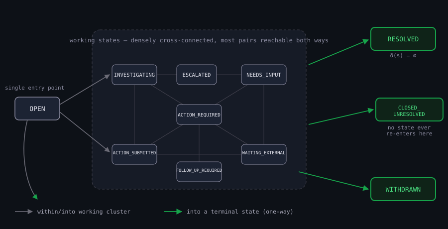
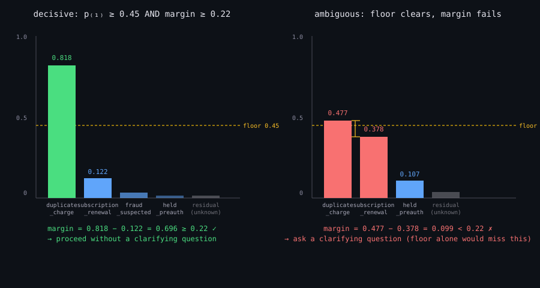
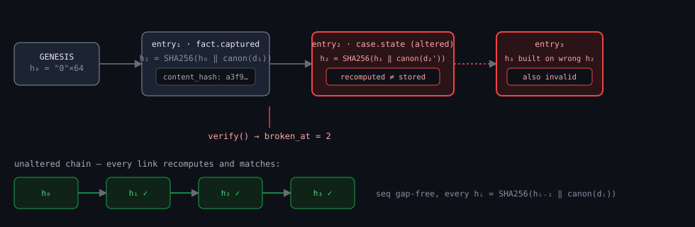
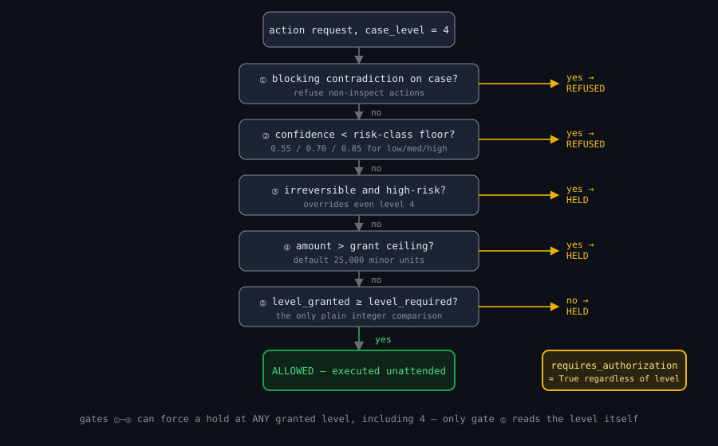
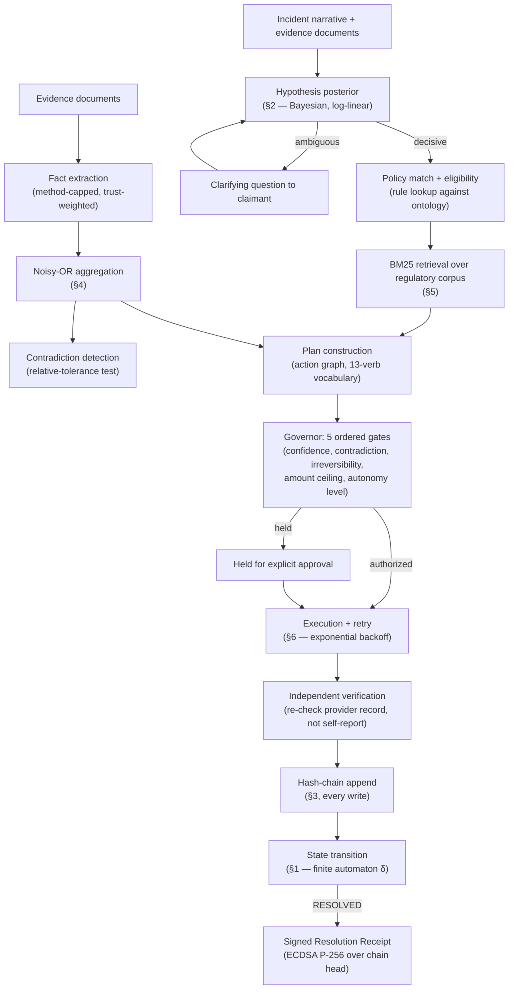

# Agent X

**Verifiable case resolution over a tamper-evident audit spine: formal state transitions, probabilistic classification, and cryptographic proof-of-erasure applied to consumer dispute resolution.**

---

## Abstract

Agent X addresses two coupled problems in automated consumer-dispute handling: (1) determining, from an unstructured natural-language account of an incident, what happened and what a claimant is entitled to, under genuine uncertainty about both the facts and the applicable rule; and (2) producing a record of the resulting actions that a party with no reason to trust the system's operator can independently verify — including verifying that data has actually been destroyed when erasure is requested, not merely marked deleted.

The system models each case as a state in a finite automaton with an explicit, enumerated transition relation, so that no case can silently skip a required step. Ambiguity in incident classification is represented as a discrete probability distribution over a catalogue of problem types, computed as a prior-weighted, evidence-adjusted posterior rather than collapsed to a single best guess; a case is only treated as resolved when that distribution concentrates past two independent thresholds. Every fact extracted from evidence carries a confidence value bounded by the extraction method and discounted by the trust class of its source; multiple independent facts supporting the same claim are combined by a noisy-OR update rather than averaged. Every write to a case's history — a fact, an inference, a state transition, an executed action — is appended to a SHA-256 hash chain, so that any alteration after the fact is detectable by recomputing the chain rather than by trusting a log. Erasure is implemented as key destruction (crypto-shredding) under AES-256-GCM envelope encryption, and the resulting certificate is signed with ECDSA over P-256 so that a party holding only the certificate and the public key — no access to Agent X's servers or database — can verify both that the certificate is unaltered and that erasure genuinely occurred.

The result is not a claim that the system's language-model component "understands" consumer law. It is a claim, checkable by inspection of the algorithms below, that every irreversible or externally consequential action the system takes is gated by an explicit, auditable decision procedure, and that every claim the system makes about its own past behavior is independently reconstructible from cryptographic primitives rather than asserted.

---

## Research Motivation

**The problem.** A consumer with a legitimate claim — a duplicate charge, a cancelled service never refunded, a subscription renewed without disclosure — faces two independent difficulties. First, determining *which* remedy applies requires connecting a specific factual account to a specific rule (a chargeback right, a statutory cooling-off period, a contractual cancellation clause), a mapping most consumers do not have and most general-purpose language models will produce fluently and incorrectly. Second, even a system that reasons correctly about the remedy produces an *unverifiable claim* if its own record of what evidence it examined, what it concluded, and what it did is stored as ordinary application data — a log an operator (or an attacker with database access) could alter after the fact with no external trace.

**Why this is a formal problem, not only an engineering one.** Two properties are being asked for simultaneously: correct-under-uncertainty reasoning (the classification and eligibility determination), and tamper-evidence independent of the operator's honesty (the audit and erasure guarantees). The first is a probability and decision-theory problem — representing genuine ambiguity rather than forcing a premature point estimate, and gating action on calibrated confidence rather than raw model output. The second is a cryptographic problem — a hash chain and a digital signature scheme, chosen specifically because their verification does not require trusting the party that produced them.

**Assumptions.** The system assumes: (i) incidents can be mapped, possibly ambiguously, onto a finite, explicitly maintained catalogue of problem types (the ontology, §Problem Formulation) rather than requiring open-ended legal reasoning; (ii) evidentiary facts arrive with a declared extraction method and source-trust class, which bounds — rather than proves — their reliability; (iii) the SHA-256 hash function and P-256 ECDSA are computationally secure primitives (standard cryptographic assumptions, not re-derived here); (iv) a party verifying a certificate offline has, out of band, a genuine copy of the signing public key (key-distribution trust is outside this system's scope, exactly as it is for TLS).

**What existing approaches don't provide.** A conversational agent that drafts a dispute letter without an explicit confidence/eligibility gate can produce a confident, well-formatted letter asserting an entitlement the evidence does not support. A system that logs its actions to an ordinary database table produces a record whose integrity depends entirely on trusting the database administrator. Agent X's contribution is not a new remedy-classification algorithm in the abstract — it is the coupling of an explicit uncertainty representation to an explicit action-authorization procedure (§Governor / Autonomy Model), backed by a tamper-evident record whose integrity is checkable by a third party (§Mathematical Formulation, Hash Chain).

---

## Problem Formulation

**State.** A case $c$ has a state $s(c) \in \mathcal{S}$, where

$$
\mathcal{S} = \{\texttt{OPEN}, \texttt{INVESTIGATING}, \texttt{NEEDS\_INPUT}, \texttt{ACTION\_REQUIRED}, \texttt{ACTION\_SUBMITTED},\\ \texttt{WAITING\_EXTERNAL}, \texttt{FOLLOW\_UP\_REQUIRED}, \texttt{ESCALATED}, \texttt{RESOLVED}, \texttt{CLOSED\_UNRESOLVED}, \texttt{WITHDRAWN}\}
$$

($\lvert\mathcal{S}\rvert = 11$; source: `agentx/ontology/types.py:130`). The subset $\mathcal{S}_T = \{\texttt{RESOLVED}, \texttt{CLOSED\_UNRESOLVED}, \texttt{WITHDRAWN}\} \subset \mathcal{S}$ is terminal: no transition leaves $\mathcal{S}_T$.

**Inputs.** A free-text incident narrative $u$ (the claimant's account), an optional set of evidence documents $D = \{d_1, \ldots, d_m\}$ (invoices, order confirmations, correspondence), and, per interaction, an autonomy grant $g$ specifying the maximum level of unattended action the claimant permits (§Governor / Autonomy Model).

**Latent variables.** A problem type $\tau \in \mathcal{T}$ (the ontology catalogue, 29 entries across 8 domain files under `agentx/ontology/definitions/`), which is not directly observed — only inferred, as a distribution, from $u$ and $D$ (§Mathematical Formulation, Hypothesis Posterior). A set of extracted facts $F = \{f_1, \ldots, f_n\}$, each with a predicate, a value, a declared extraction method, a source-trust class, and a derived confidence $\mathrm{conf}(f_i) \in [0,1]$.

**Outputs.** A remedy determination (which entitlements apply and under what cited basis), an executable plan (a sequence of actions, each drawn from a fixed 13-verb vocabulary in `agentx/execution/actions.py`), a sequence of execution records (what was attempted and what was independently observed in response — never a self-reported "success" with no external check), and, at case closure, a signed **Resolution Receipt** binding the case's full hash chain to an ECDSA signature.

**Constraints.** Every state transition must belong to the explicit relation $\delta: \mathcal{S} \to 2^{\mathcal{S}}$ defined in `agentx/case.py:37-65` (§Mathematical Formulation, State Transition Function) — an attempted transition $s \to s'$ with $s' \notin \delta(s)$ is rejected, not silently coerced. Every action with `required_level` exceeding the case's granted autonomy level is held for confirmation rather than executed (§Governor / Autonomy Model). Every write to the case record is chained (§Mathematical Formulation, Hash Chain); no update path exists that bypasses the chain.

---

## Mathematical Formulation

Six subsystems in this codebase are governed by an explicit, non-trivial formula, each derived below in the order it participates in the case lifecycle: classification → evidence aggregation → audit chain → retrieval → execution retry → cryptographic sealing. Subsystems governed by rule tables or threshold comparisons rather than a mathematical combination (the state machine, the autonomy governor) are presented as explicit relations rather than dressed up as continuous formulas — see the note at the start of each subsection.

### 1. State Transition Function

The case lifecycle is a deterministic finite automaton, not a formula. It is stated formally here because its *enforcement* is the operative guarantee: an illegal transition raises rather than executes.

$$
\delta : \mathcal{S} \to 2^{\mathcal{S}}, \qquad \text{transition}(c,\, s') \text{ succeeds} \iff s' \in \delta(s(c)) \;\lor\; s' = s(c)
$$

$\delta$ is the literal table at `agentx/case.py:37-65` — e.g. $\delta(\texttt{OPEN}) = \{\texttt{INVESTIGATING}, \texttt{NEEDS\_INPUT}, \texttt{WITHDRAWN}\}$, and $\delta(s) = \emptyset$ for every $s \in \mathcal{S}_T$. A same-state request ($s' = s(c)$) is a no-op (returns unchanged, appends nothing to the chain); any other $s' \notin \delta(s(c))$ raises `InvalidTransition`, a `ValueError` subclass, at the point of the attempted write — there is no code path that persists a transition outside $\delta$. Every accepted transition appends a `case.state` record to the case's hash chain (§3) carrying `{from_state, to_state, because}`, so the full transition history — not just the current state — is independently reconstructible and tamper-evident.

**Why this matters to the implementation.** A case cannot, for example, move from `RESOLVED` back to `INVESTIGATING`, and cannot skip from `OPEN` directly to `ACTION_SUBMITTED` without an intervening `ACTION_REQUIRED`. This is what makes "what actually happened on this case" a well-defined question with one answer, rather than a question whose answer depends on which log line is trusted.

<p align="center"></p>
<p align="center"><sub><b>Figure 1.</b> OPEN is the only entry point; seven working states are densely cross-connected (most transitions between them are legal in both directions); exactly three transitions lead out to a terminal state, and δ(s) = ∅ for all three — nothing re-enters. The full 30-edge transition table (§1, <code>agentx/case.py:37-65</code>) is exact; this figure shows the shape that table has.</sub></p>

### 2. Hypothesis Posterior (Incident Classification Under Ambiguity)

**Motivation.** A narrative like *"I was charged twice"* is consistent with several problem types (duplicate charge, subscription renewal the claimant forgot, a held pre-authorization later captured). Committing to the single highest-scoring label discards exactly the information — how contested the classification is — that determines whether the system should proceed or ask a clarifying question. The system therefore computes a distribution, not a label.

For each catalogued hypothesis $h_i \in \mathcal{T}$ with declared prior $\pi_i$ and an accumulated evidence score $z_i$ (a signed sum of phrase-match, pattern-match, negative-signal, and domain-hint weights — `agentx/understanding.py:294-330`), the unnormalized posterior mass is

$$
m_i = \pi_i \, e^{z_i}
$$

— a log-linear combination: additive in the evidence score $z_i$, multiplicative in probability space. Normalizing over all hypotheses plus a fixed **residual mass** $\rho$ (reserved probability that *none* of the catalogued hypotheses is correct) gives

$$
p_i \;=\; \frac{m_i}{\rho + \sum_{j} m_j}\,, \qquad \rho = 0.04 \;\; (\texttt{RESIDUAL\_PRIOR}, \texttt{agentx/understanding.py:64})
$$

so that $\sum_i p_i = 1 - \rho_{\text{remaining}} \le 1 - \rho$, with the residual $\rho_{\text{remaining}} = 1 - \sum_i p_i$ tracked explicitly (`residual_mass()`, `agentx/understanding.py:413-419`) rather than discarded — the distribution is over $\mathcal{T} \cup \{\text{unknown}\}$, and "unknown" is a first-class outcome the downstream planner must handle (§General-Problem Fallback, below), not an error state.

**Ambiguity decision.** Let $p_{(1)} \ge p_{(2)} \ge \cdots$ denote the sorted posteriors. The classification is treated as *decisive* — and only then does the case proceed without a clarifying question — iff both

$$
p_{(1)} \ge 0.45 \quad\text{(}\texttt{DECISIVE\_FLOOR}\text{)} \qquad\text{and}\qquad p_{(1)} - p_{(2)} \ge 0.22 \quad\text{(}\texttt{DECISIVE\_MARGIN}\text{)}
$$

hold simultaneously (`agentx/understanding.py:56-57, 430-440`). The conjunction is deliberate: a high top score with a close runner-up (genuine rivalry between two plausible readings) and a comfortable margin over a low top score (thin evidence that happens to edge out an even thinner alternative) are both treated as ambiguous, for different reasons — a single-threshold test on the margin alone would miss the second case.

<p align="center"></p>
<p align="center"><sub><b>Figure 2.</b> Both panels are computed from the actual formula above, not illustrative sketches. Left: a top posterior of 0.818 with a 0.696 margin clears both thresholds. Right: a top posterior of 0.477 clears the 0.45 floor alone, but its 0.099 margin over the runner-up fails the 0.22 test — this is exactly the case a floor-only rule would misclassify as decisive.</sub></p>

**Optional second-stage fusion.** When an LLM classification is available, it is combined with the deterministic posterior above by the **geometric mean**, not a weighted average:

$$
p_i^{\text{fused}} = \sqrt{\,p_i^{\text{det}} \cdot p_i^{\text{llm}}\,}\,, \quad\text{renormalized so } \textstyle\sum_i p_i^{\text{fused}} = 1
$$

(`agentx/understanding.py:593-648`). The geometric mean is used specifically because it is zero whenever *either* side assigns near-zero probability: neither the deterministic pass nor the LLM pass can unilaterally drive a hypothesis toward certainty, and a hypothesis neither source supports cannot survive fusion. An arithmetic mean does not have this property (one confident source can dominate an indifferent one).

**Why this is the right computational procedure.** The system needs a decision — proceed, or ask — that degrades gracefully as evidence weakens, rather than a hard classifier that is either right or silently wrong. The log-linear posterior gives a continuous confidence value; the two-threshold decisiveness test converts that continuous value into the binary "proceed vs. clarify" decision the planner actually consumes.

### 3. Hash Chain (Tamper-Evident Audit Log)

**Motivation.** A record of "what Agent X did on this case" is only as trustworthy as it is hard to alter without detection. An ordinary append-only log satisfies "hard to *delete from*" if the underlying store enforces it, but says nothing about alteration of an existing row. Chaining each entry's hash into the next entry's hash input makes any single-row alteration recompute-detectable, because it invalidates every hash from that point forward.

Let $\mathrm{detail}_i$ be the JSON-serializable payload of the $i$-th chain entry for a case (a fact, an inference, a state transition, an execution record). Define the canonical serialization

$$
\mathrm{canon}(x) = \texttt{json.dumps}(x,\ \texttt{sort\_keys=True},\ \texttt{separators=(',',':')})
$$

(deterministic key ordering, no incidental whitespace — two semantically identical objects always serialize to the same bytes; `core/trust/audit.py:30-38`). The chain is then the recurrence

$$
h_0 = \underbrace{\texttt{"0"} \times 64}_{\text{GENESIS}}\,, \qquad h_i = \mathrm{SHA256}\!\big(\,h_{i-1} \,\Vert\, \mathrm{canon}(\mathrm{detail}_i)\,\big), \quad i = 1, 2, \ldots
$$

where $\Vert$ is string concatenation (not a delimiter-separated join) and $h_i$ is stored as the row's `content_hash`, with $h_{i-1}$ stored as its `prev_hash` (`agentx/chain.py:104-107`; shared primitive `core/trust/audit.py:41-43`).

**Verification** recomputes this recurrence from $h_0$ and compares at each step (`agentx/chain.py:131-156`):

$$
\text{valid} \iff \forall i:\quad \mathrm{seq}_i = i \;\land\; \mathrm{prev\_hash}_i = h_{i-1} \;\land\; \mathrm{SHA256}(h_{i-1} \Vert \mathrm{canon}(\mathrm{detail}_i)) = \mathrm{content\_hash}_i
$$

The sequence check ($\mathrm{seq}_i = i$) independently catches row deletion (a gap in the sequence), which a pure hash check alone would not — a deleted row simply isn't there to check. Verification returns the index of the *first* break found, `broken_at`, so a caller learns not just *that* tampering occurred but *where* the chain first diverges from what it should be. A single **chain digest** — one hash summarizing the entire chain — is separately computed as $\mathrm{SHA256}\big(\bigoplus_i \texttt{"seq|prev|content|detail"}_i\big)$ (`agentx/chain.py:201-211`) for cheap equality checks between two claimed copies of the same chain without re-verifying every link.

**Why this is the correct primitive for the stated goal.** The chain does not prevent an operator with database access from deleting the *entire* history of a case — no purely additive log can. What it prevents is *undetected partial alteration*: changing one historical fact, one confidence value, or one state transition without also recomputing every hash after it, which requires knowing the chain was altered in the first place. Independent verification (`GET /api/agentx/cases/{case_id}/chain`) recomputes the full recurrence from stored data — it does not consult any separately-trusted log.

<p align="center"></p>
<p align="center"><sub><b>Figure 3.</b> Altering entry₂'s payload changes h₂, which changes the input to h₃'s hash — the break at position 2 propagates forward through every later entry, which is exactly what <code>verify()</code> detects and reports as <code>broken_at</code>. The bottom row shows the same recurrence with no alteration: every recomputed hash matches its stored value.</sub></p>

### 4. Confidence Aggregation (Noisy-OR)

**Motivation.** When multiple independent pieces of evidence support the same factual claim (e.g., three documents all stating the charge amount), the claim's confidence should increase with corroboration but must never exceed certainty, and a single low-confidence fact should not by itself drag down a claim already well-supported by a high-confidence one — properties a simple average does not have (averaging *always* pulls toward the weaker input).

Each individual fact's confidence is first bounded by its extraction method and discounted by its source's trust class:

$$
\mathrm{conf}(f) = \min\!\big(\mathrm{conf}_{\text{raw}}(f),\; c_{\text{method}}\big) \cdot w_{\text{trust}}(f)
$$

where $c_{\text{method}} \in \{0.96, 0.98, 0.72, 0.60\}$ for {deterministic, provider-record, LLM, user-stated} extraction respectively, and $w_{\text{trust}} \in \{1.0, 0.95, 0.85, 0.75, 0.70\}$ for {issuer document, provider record, third party, derived, user capture} (`METHOD_CEILING`, `TRUST_WEIGHT`, `agentx/evidence/extract.py:88-94, 133-135`) — an LLM-extracted value can never be reported above 0.72 confidence regardless of how confident the model claims to be, and a user's own unverified statement caps at 0.60.

Given $n$ facts $f_1, \ldots, f_n$ independently supporting one claim, each individually capped at 0.98, the combined confidence is the **noisy-OR** update

$$
P(\text{claim}) \;=\; \min\!\left(0.99,\; 1 - \prod_{i=1}^{n} \big(1 - \min(0.98,\, \mathrm{conf}(f_i))\big)\right)
$$

(`combine_confidence`, `agentx/evidence/graph.py:267-282`). This is the standard probabilistic-OR combination under an independence assumption: $1 - \prod_i(1-p_i)$ is exactly $P(\text{at least one of } n \text{ independent events occurs})$ when $p_i$ is read as "fact $i$ correctly supports the claim." Two caps — 0.98 per fact, 0.99 on the result — guarantee the aggregate can never reach certainty, reflecting that no finite amount of corroborating evidence should be treated as absolute proof.

**Contradiction is a separate, non-probabilistic override.** If a predicate is flagged `CONTESTED` (§Contradiction Detection below), the noisy-OR result is simply capped at 0.5 (`agentx/evidence/graph.py:305-312`) — an explicit ceiling, not folded into the aggregation formula, because a contested claim's problem is disagreement, not insufficient corroboration; more agreeing facts should not be able to out-vote a genuine conflict.

**Contradiction detection** between two numeric readings $x, y$ of the same predicate uses a per-predicate relative tolerance:

$$
\text{no conflict} \iff \frac{|x - y|}{\max(|x|,\,|y|,\,1)} \le \mathrm{tol}(\text{predicate})
$$

with $\mathrm{tol} = 0$ for monetary predicates (charge amount, invoice total, refund amount — "money has none: currency is exact"), $\mathrm{tol} = 0.05$ for flight delay minutes, $\mathrm{tol} = 0.03$ for flight distance, and a default of $\mathrm{tol} = 0.01$ otherwise (`TOLERANCE`, `agentx/evidence/contradiction.py:72-94`). A currency-unit mismatch is flagged separately as *incomparable*, distinct from a numeric disagreement.

### 5. BM25 Passage Retrieval (Regulatory Corpus)

**Motivation.** Citing a rule requires finding, from a fixed corpus of 75 regulatory passages (`agentx/knowledge/corpus.jsonl`), the passages actually relevant to a case's narrative — a deterministic, reproducible ranking rather than an opaque embedding similarity, chosen specifically because a ranking that can sit on the hash chain (§3) as a citation must be independently recomputable from the same corpus and query.

For query terms $q_1, \ldots, q_k$ (deduplicated: $q_{\text{unique}}$, so repeated query terms do not multiply the score) against a document (passage) $d$ of length $|d|$ in a corpus of $N$ documents with mean length $\overline{|d|}$:

$$
\mathrm{score}(q, d) = \sum_{t \,\in\, q_{\text{unique}} \,\cap\, d} \mathrm{idf}(t) \cdot \frac{f(t,d)\,(k_1+1)}{f(t,d) + k_1\!\left(1 - b + b\dfrac{|d|}{\overline{|d|}}\right)}, \qquad k_1 = 1.2,\ \ b = 0.75
$$

$$
\mathrm{idf}(t) = \max\!\left(0,\ \ln\!\left(1 + \frac{N - \mathrm{df}(t) + 0.5}{\mathrm{df}(t) + 0.5}\right)\right)
$$

where $f(t,d)$ is the term frequency of $t$ in $d$ and $\mathrm{df}(t)$ the number of passages containing $t$ (`agentx/knowledge/retrieve.py:40-41, 147-148, 160-168`). This is standard BM25 with the $\max(0, \cdot)$ floor on IDF — the standard Robertson–Spärck-Jones IDF can go negative for terms appearing in more than half the corpus, which would let an over-common term *subtract* from a score; the floor prevents that. One deliberate deviation from the textbook form: a passage's title tokens are counted with **triple weight** relative to body tokens when building $f(t,d)$ and $|d|$ (`agentx/knowledge/retrieve.py:103-121`), reflecting that a title match on a regulation name is a stronger relevance signal than an equal-count body match.

**Gating.** A passage is returned only if it clears three simultaneous floors — a minimum BM25 score, a minimum count of distinct matched query terms, and a minimum summed IDF mass over matched terms (`MIN_SCORE = 2.5`, `MIN_MATCHED_TERMS = 2`, `MIN_MATCHED_MASS = 8.5`; `agentx/knowledge/retrieve.py:44-46, 170-171`). These constants are stated in the source as empirically calibrated against the current corpus and test set — the code comment reports roughly an 8% separation between the strongest false hit (score 8.2) and the weakest true one (8.98) — and are explicitly not claimed to generalize to a different corpus without recalibration.

### 6. Execution Retry (Exponential Backoff with Jitter)

**Motivation.** A transient failure calling an external provider (a timeout, a momentary 5xx) should be retried briefly in-process; a failure expected to persist for minutes or longer should not block the request thread and is instead deferred to the scheduled remediation pass (`agentx/sentinel.py`) — the two are complementary, not duplicate mechanisms, split by an explicit delay threshold.

For attempt number $a = 1, 2, \ldots$ (the attempt just completed), the delay before the next attempt is

$$
\mathrm{base}(a) = \min\!\big(d_{\max},\, d_0 \cdot 2^{a-1}\big), \qquad \mathrm{delay}(a) = \max\!\big(0,\ \mathrm{base}(a) + U(-j\cdot\mathrm{base}(a),\ +j\cdot\mathrm{base}(a))\big)
$$

with $d_0 = 0.4\text{s}$ (`base_delay`), $d_{\max} = 2.0\text{s}$ (`max_delay`), $j = 0.3$ (`jitter`, ±30% multiplicative), and $U(\cdot,\cdot)$ the continuous uniform distribution (`agentx/execution/retry.py:34-77`). This is standard exponential backoff (doubling per attempt, capped) with symmetric multiplicative jitter — the jitter exists specifically to prevent synchronized retry storms when many failures are correlated (e.g., a provider outage causing simultaneous retries from many concurrent cases). A provider-supplied `retry_after` value, when present, overrides the formula entirely (respecting an explicit rate-limit signal takes precedence over a generic backoff schedule). By default at most 3 total attempts are made (`max_attempts`); any computed delay exceeding `max_inline_delay` (also 2.0s) is not waited out synchronously — the attempt is instead marked `deferred_to_scheduler` and handed to the longer-horizon remediation path, so a request thread never blocks for more than 2 seconds on a single retry.

---

## Governor / Autonomy Model

Not a formula — an explicitly ordered rule evaluation, stated here as a relation rather than framed as continuous mathematics it is not. Every action the system might take is assessed against five ordered gates (`agentx/governor.py:129-216`), any of which can force `requires_authorization = True` regardless of the case's granted autonomy level:

| Level | Meaning |
|---|---|
| 0 | Information only — nothing leaves the device |
| 1 | Analysis and recommendation — the user acts |
| 2 | Prepare and confirm — every action is staged and shown before sending |
| 3 | Act on reversible things — sent unattended, reported after |
| 4 | Autonomous under a written policy — permanent actions within an explicit ceiling/expiry/action-type policy |

Evaluation order: **(1)** a blocking contradiction on the case refuses non-inspection actions outright; **(2)** confidence below a risk-class floor ($0.55$/$0.70$/$0.85$ for low/medium/high risk) refuses; **(3)** any irreversible, high-risk action *always* requires explicit per-action authorization, even under a level-4 standing grant; **(4)** a monetary amount exceeding the grant's ceiling (default $25{,}000$ minor units, e.g. \$250.00) requires authorization; **(5)** only after all four hold does a plain comparison $\text{level}_{\text{granted}} \ge \text{level}_{\text{required}}$ decide the outcome, where $\text{level}_{\text{required}} = \max(\text{capability's declared level},\ \{1,2,3\}[\text{risk class}])$. The ordering is the specification: a standing level-4 grant does not bypass gates (1)–(4).

<p align="center"></p>
<p align="center"><sub><b>Figure 4.</b> A case granted level 4 (the highest standing autonomy) still has its action held at gate ③ if the action is irreversible and high-risk — the plain level comparison at gate ⑤ is the <i>last</i> check, not the only one, and cannot be reached by an action that fails an earlier gate.</sub></p>

---

## Computational / Numerical Model

**Storage engine selection.** The system runs against either CockroachDB (full guarantees, including `AS OF SYSTEM TIME` proof-of-prior-existence and vector recall) or a local SQLite file (`agentx/store.py:60-99`) — selected automatically at first use by attempting a 3-second-timeout connection to `DATABASE_URL` and falling back to SQLite on failure or absence, never silently discarding a write either way. Both engines execute the identical portable SQL subset (`db/migrations/005`–`009`) for the case layer, so the formulas above (state transitions, hash chain, evidence aggregation) behave identically on either engine; only `AS OF SYSTEM TIME` time-travel proofs and the vector index are CockroachDB-exclusive.

**Discretization is at the level of discrete events, not a continuous field.** There is no continuous-time or continuous-space simulation in this system to discretize — every "step" (a fact extraction, a state transition, a retry attempt, a chain append) is already a discrete event triggered by an API call or a scheduled sweep. The retry recurrence (§6) is the one place a continuous quantity (elapsed real time) is computed from a discrete counter ($a$), and it is presented above exactly as implemented.

**Complexity.** Hash-chain verification is $O(n)$ in the number of chain entries for a case (one hash recomputation per entry). BM25 retrieval is $O(|q_{\text{unique}}| \cdot N)$ against the corpus in the current implementation (linear scan with precomputed term-frequency tables; the corpus size, $N = 75$, is small enough that an inverted index has not been necessary). Noisy-OR aggregation is $O(n)$ in the number of supporting facts. None of these are performance-critical paths at current scale; they are noted here for completeness, not as a claimed contribution.

---

## Where a Language Model Enters the Pipeline

To state precisely what role external LLM calls play, and to avoid the imprecision the alternative invites:

$$
\text{Narrative } u \;\to\; \text{deterministic lexical/pattern scoring (§2)} \;\to\; p_i^{\text{det}} \;\xrightarrow{\text{optional}}\; \text{LLM classification} \;\to\; p_i^{\text{llm}} \;\to\; p_i^{\text{fused}} = \sqrt{p_i^{\text{det}} \cdot p_i^{\text{llm}}}
$$

The deterministic posterior (§2) is computed first and is sufficient on its own to drive the pipeline — an LLM call is an optional second-stage refinement, not a dependency. The same two-stage-or-deterministic-alone pattern applies to policy drafting (`agentx/letters.py`) and evidence extraction (`agentx/evidence/extract.py`): an LLM extraction is capped at $0.72$ confidence by construction (§4) specifically *because* it is treated as less reliable than a deterministic or provider-record extraction, not as reliable evidence in its own right. No component of this system trains a model or defines a training loss; every LLM call is an inference-time request to an external API (Cerebras, Groq, or a local Ollama instance, configured via `LLM_PROVIDER`/`LLM_ENDPOINT`), and its output is treated throughout as one more piece of evidence subject to the same confidence bounds as any other source — never as ground truth.

---

## Cryptographic Model (Envelope Encryption and Signed Attestation)

**Crypto-shredding.** Each subject (a case, keyed as `case:{case_id}`) has a per-subject 256-bit data-encryption key (DEK), generated by `AESGCM.generate_key(bit_length=256)` and wrapped (encrypted) under a root key via AES-256-GCM before storage (`agentx/sealing.py:233–273`). Content is sealed under the DEK, never under the root key directly (standard envelope encryption — the root key is never exposed to bulk data, and rotating the wrapping does not require re-encrypting all content). **Erasure is key destruction, not row deletion**: shredding executes

```sql
UPDATE agentx_subject_keys SET wrapped_dek = NULL, destroyed_at = %s WHERE workspace = %s AND subject = %s
```

(`agentx/sealing.py:319-335`) — the row persists (so a future lookup resolves to "key destroyed," not "no record ever existed") but `wrapped_dek` becomes irrecoverable, which makes every ciphertext sealed under that DEK computationally unrecoverable, including in any backup or replica that predates the shred. Verification re-reads the row and reports `key_row_present`, `key_material_null`, `destroyed_at_set`, `unrecoverable` as booleans derived from the current database state (`verify_shredded`, `agentx/sealing.py:338-350`) — a re-read, not an assertion.

**Signed attestation.** An erasure or resolution certificate is signed with ECDSA over the P-256 curve (`ec.SECP256R1()`), with SHA-256 as the message digest (`aws/certificate.py:37-141`, `core/trust/certificate.py:107-132`). The certificate body — never including the raw subject identifier, only a salted $\mathrm{SHA256}(\text{salt} \,\Vert\, \text{workspace} : \text{subject})$, with the salt kept separately so the certificate alone cannot be brute-forced back to the subject — is canonicalized identically to chain entries (§3), then:

$$
h = \mathrm{SHA256}(\mathrm{canon}(\text{cert})), \qquad \sigma = \mathrm{Sign}_{\text{ECDSA-P256}}\big(\text{sk},\ \mathrm{canon}(\text{cert})\big)
$$

Verification independently recomputes $h$ and checks it against the claimed value, and independently verifies $\sigma$ against the corresponding public key — both checks fail closed (an unsigned or altered certificate reports `signature_valid: null` or `false`, never a default-true). Where a database connection is available, verification additionally recomputes the case's live chain head and length and checks them against the values bound into the certificate at signing time, which distinguishes *truncation* (a shorter chain than claimed — row-count mismatch) from *tampering* (an altered chain — hash mismatch) as two different failure modes with two different causes. The `/verify-offline` path performs only the hash and signature checks, with zero network calls — deliberately, so verification does not require trusting the party being verified.

---

## System Architecture



Every arrow into `CHAIN` corresponds to an actual `chain.append()` call in the source — the diagram is a description of control flow that exists, not an aspirational pipeline.

---

## Algorithms

**`transition(case_id, to_state)`** — §1. $O(1)$: a single dict lookup ($\text{to\_state} \in \delta[\text{from\_state}]$) plus one chain append on success. Purpose: the sole write path for case state; every other code path that needs to move a case forward calls through this function rather than writing `state` directly, so $\delta$ cannot be bypassed by omission.

**`hypotheses(narrative, evidence)`** — §2. $O(|\mathcal{T}| \cdot L)$ where $L$ is narrative length (each of 29 catalogued hypotheses is scored against the tokenized narrative independently). Purpose: replace a single classifier call with an inspectable, re-derivable distribution — every $p_i$ can be recomputed from the stored $\pi_i, z_i$ without re-running any model.

**`combine_confidence(facts)`** — §4. $O(n)$ in supporting-fact count. Purpose: the single point through which every multi-source claim's confidence passes, so a downstream consumer (the governor's confidence-floor gate, §Governor) sees one calibrated number rather than reimplementing aggregation per call site.

**`call_with_retry(fn, policy)`** — §6.
```
attempt ← 0
loop:
    attempt ← attempt + 1
    result ← fn()
    if not should_retry(result, attempt, policy): return result
    delay ← delay_for(attempt, policy, retry_after=result.retry_after)
    if delay > policy.max_inline_delay:
        mark result deferred_to_scheduler; return result
    sleep(delay)
```
Purpose: the single execution choke point (`agentx/execution/runner.py`) through which every external provider call passes, so retry behavior is uniform across all thirteen action types rather than reimplemented per provider.

**`bm25_search(query, corpus)`** — §5. $O(|q_{\text{unique}}| \cdot N)$. Purpose: deterministic, re-derivable citation retrieval — given the same corpus snapshot and query, the ranking is exactly reproducible, which matters because a citation is recorded on the hash chain and must be independently checkable.

---

## Experimental Methodology

This is not a benchmark-driven ML project with a held-out test set and a leaderboard metric; it is a rule-and-cryptography-driven system whose correctness claims are checked by **behavioral scenario tests** and **structural verification** rather than statistical evaluation.

**Scenario tests** (`agentx/demo.py`, exercised in `tests/test_agentx_demo.py`): five scripted-but-realistic consumer scenarios (duplicate charge, unauthorized subscription renewal, cancelled flight, undisclosed fee, damaged-goods return) run end to end against five deterministic sandbox counterparties that stall, refuse, or partially concede in ways that require the follow-up/escalation logic (`agentx/followup.py`) to actually engage — not scenarios a single-shot response would resolve. Each scenario's pass condition includes the produced hash chain re-verifying intact (§3) and the final receipt's signature independently checking out (§Cryptographic Model), not merely that a plausible-looking letter was generated.

**Structural / property tests**: the 31-file test suite (`tests/`) includes dedicated coverage for the state machine's transition table (illegal transitions correctly raise), the retry backoff formula (`tests/test_agentx_retry.py`, exercising `should_retry`/`delay_for` directly against the formulas in §6), governor gate ordering (`tests/test_agentx_governor.py` — confirming gates (1)–(4) can each independently force authorization regardless of granted level), and offline-write refusal (`tests/test_offline_writes.py` — confirming the system reports 503, never a fabricated 200, when the database is unreachable).

**Reproducibility of retrieval results**: because BM25 (§5) is deterministic given the corpus snapshot, retrieval test assertions pin exact expected passage IDs for fixed queries rather than approximate-match assertions — a genuine regression in scoring changes which exact IDs are returned.

**What is not evaluated here**: there is no held-out labeled dataset of real consumer complaints against which classification accuracy (§2) is measured, and no such number is claimed. The 29-hypothesis ontology and the BM25 gating constants (§5) are described in the source as calibrated against the project's own test scenarios; generalization to complaint narratives outside that distribution is untested and is stated as a limitation below, not implied by omission.

---

## Results

The verifiable, reproducible result this system currently reports is structural, not statistical:

- **515 tests passing, 9 skipped** (skipped tests are gated on unavailable external services — e.g. a live CockroachDB or an installed `portia` package — and are not silent failures; each skip carries an explicit reason).
- **All five sandbox scenarios (`agentx/demo.py`) resolve end-to-end with an intact, independently-verifying hash chain and a valid ECDSA signature on the final receipt** — checked by `tests/test_agentx_demo.py` on every run, not asserted once and left to bit-rot.
- **Offline certificate verification (`/verify-offline`) performs zero network calls** and independently reconstructs both the SHA-256 content hash and the ECDSA signature check from the certificate and a public key alone — this is a structural property of the code path (no `fetch`/`XMLHttpRequest` in the offline verifier), not a measured latency or accuracy number.

No classification-accuracy, retrieval-precision, or user-outcome statistics are reported, because none have been measured against an external ground truth. Presenting a number here without that measurement would be exactly the kind of fabricated result this document is written to avoid.

**Planned evaluation** (not yet performed): precision/recall of the hypothesis posterior (§2) against a held-out set of labeled real (anonymized) consumer narratives, and BM25 retrieval precision@k against a citation-relevance judgment set — both require data collection outside this repository's current scope.

---

## Error and Uncertainty Analysis

Uncertainty in this system is represented at three distinct levels, each with a different source and a different formal treatment — conflating them would misstate what the system actually knows:

1. **Extraction uncertainty** — a single fact's confidence, $\mathrm{conf}(f) \le c_{\text{method}} \cdot w_{\text{trust}}$ (§4), is a *declared upper bound* tied to how the fact was obtained, not a statistically calibrated probability of correctness. It is a design choice about how much to trust a method, stated explicitly as such in the source, not a measured error rate.
2. **Aggregation uncertainty** — the noisy-OR combination (§4) is exact *given* the independence assumption between supporting facts. That assumption is not verified; two facts drawn from the same underlying document (e.g., a total re-stated in two places on one invoice) are not truly independent evidence, and the current implementation does not detect or correct for this. This is a genuine, stated approximation, not a hidden one.
3. **Classification uncertainty** — the hypothesis posterior (§2) is a distribution over a *closed* catalogue $\mathcal{T}$ plus a residual "unknown" bucket. It cannot express uncertainty about whether $\mathcal{T}$ itself is the right catalogue for a narrative outside its scope — the residual mass $\rho_{\text{remaining}}$ is the system's only signal for "none of these," and a narrative describing a genuinely novel problem type is not distinguished from a poorly-worded description of a known one; both simply produce diffuse posteriors.

No RMSE/MAE-style predictive-error metric is reported, because there is no continuous predicted-vs-reference quantity in this system's outputs to measure against (§Results explains why no accuracy statistic is claimed) — introducing one here would not correspond to anything the implementation computes.

---

## Validation

Properties checked against the implementation, each corresponding to a specific guarantee claimed above:

- **Hash-chain integrity**: every scenario test (`tests/test_agentx_demo.py`) re-verifies the produced chain via full recomputation (§3), not by trusting the chain that was written.
- **State-machine soundness**: `tests/test_agentx_case.py` asserts that every $(s, s')$ pair *not* in $\delta(s)$ is rejected, and that every pair that *is* in $\delta(s)$ succeeds — a complete check against the table, not a sample of it.
- **Governor gate ordering**: `tests/test_agentx_governor.py` constructs cases that would pass gate (5) (sufficient granted level) but fail an earlier gate (e.g., a high-risk irreversible action under a level-4 grant), and asserts the earlier gate still fires — checking the *ordering* is enforced, not just that each gate works in isolation.
- **Crypto-shred unrecoverability**: `tests/test_trust.py` and the evaluation harness `evals/rrs.py` attempt to recover shredded content directly from the database/backup layer after a shred, asserting the attempt fails — this validates the *destruction* claim empirically against the actual storage layer, not just against the function's return value.
- **Offline-write refusal**: `tests/test_offline_writes.py` confirms that with the database unreachable, mutating routes return HTTP 503 with `written: false` and never a fabricated 200 — the honesty of the failure path is itself a tested property.
- **Signature verification failure modes**: certificate verification tests confirm that an altered certificate body, a certificate signed by a different key, and an unsigned certificate each produce a distinct, correctly-labeled failure (`hash_matches: false`, `signature_valid: false`, `signature_valid: null` respectively) rather than collapsing to one generic "invalid" result.

**Not applicable here, and not included**: conservation laws, symmetry checks, dimensional analysis of physical quantities, and convergence/stability analysis of a numerical integrator. This system contains no continuous physical model and integrates no differential equation; validating against physical conservation principles would not correspond to anything the implementation does, and no such section is included per the standard stated at the top of this document — mathematics is included only where it explains, derives, or validates an actual implemented mechanism.

**One conservation-style check that *is* applicable and *is* performed**: the hypothesis posterior (§2) is checked to satisfy $\sum_i p_i + \rho_{\text{remaining}} = 1$ exactly (a probability-mass conservation identity, not a physical one) — `residual_mass()` computes $\rho_{\text{remaining}}$ as the residual directly from the normalized posteriors rather than as an independently-tracked value, so this identity holds by construction and is exercised by `tests/test_agentx_ontology.py`.

---

## Limitations

**Classification.** The 29-entry ontology and the lexical/pattern scoring weights (§2) are hand-authored and calibrated against the project's own test scenarios, not learned from or validated against a corpus of real, labeled consumer complaints. Narratives well outside the phrasing patterns the scoring functions were tuned against will likely produce diffuse, low-confidence posteriors — correctly triggering a clarifying question rather than a wrong confident answer, but at the cost of asking more often than a system tuned on broader data would need to.

**Evidence independence.** The noisy-OR aggregation (§4) assumes supporting facts are independent evidence; the implementation does not detect near-duplicate provenance (two facts derived from the same source document), so confidence can be inflated by re-stating the same underlying fact from multiple extraction passes over one document.

**Retrieval scope and calibration.** The regulatory corpus is 75 passages; BM25 (§5) can only retrieve what is present, and no automated process currently detects when a case's applicable rule is entirely absent from the corpus, versus present but poorly matched by the query terms — a missing citation and a bad-match citation are not currently distinguished for the caller. The gating constants ($2.5$, $2$, $8.5$) are stated in source as empirically fit to the current corpus and are not claimed to transfer to a different or larger corpus without recalibration.

**LLM-dependent paths degrade, not fail, without a configured model.** Classification, planning, and letter-drafting have deterministic fallback paths (§Where a Language Model Enters the Pipeline), but the fallback is necessarily less nuanced than the LLM-refined result; a deployment with no configured `LLM_PROVIDER` will produce coarser hypothesis fusion and less naturally-phrased drafted correspondence, not a different guarantee tier of correctness.

**Live provider integration is partial by design, not by oversight.** Of the registered execution providers, only outbound email (SMTP) and read-only HTTP GET (`live:browser`) perform genuine external I/O in the current implementation; providers for merchant refund requests, booking retrieval, and payment escalation are intentionally registered as unavailable (`configured() → False`) until a real integration exists, rather than simulating success — this is a stated scope boundary, not a silently incomplete feature.

**No formal proof of the governor's gate ordering is given** — the ordering (§Governor / Autonomy Model) is validated by test cases covering specific gate interactions (§Validation), not by an exhaustive proof that every possible combination of the five gates' preconditions is correctly ordered. A gate interaction not covered by an existing test is unverified, not verified-and-passing.

**Cryptographic scope.** Key-distribution trust (how a verifier obtains a genuine copy of the signing public key) is explicitly out of scope, consistent with standard practice for signature schemes generally — this system provides no additional mechanism (e.g., a certificate authority or a transparency log for public keys themselves) beyond the signature check.

---

## Reproducibility

**Environment.** Python 3.12, dependencies pinned in `requirements.txt` (core) and `requirements-capabilities.txt` (optional capability tracks — see `agentx/subsystems/`).

```bash
python -m venv .venv
.venv\Scripts\activate            # Windows
pip install -r requirements.txt
```

**Configuration.** Copy `.env.example` to `.env`. Minimum to boot: nothing — the system auto-falls-back to a local SQLite engine (`agentx/store.py`) with no configuration at all. For the full CockroachDB-backed guarantee set (`AS OF SYSTEM TIME` proofs, vector recall):

```bash
python scripts/init_db.py         # generates AGENT_X_ROOT_KEY, applies schema
```

**Running the server:**

```bash
uvicorn app.main:app --host 127.0.0.1 --port 8000
```

**Running the test suite** (validates every claim in §Validation directly):

```bash
pytest tests/ -q
```

Expected output: `515 passed, 9 skipped` on an environment with no external services configured (CockroachDB, hosted LLM, AWS) — the 9 skips are exactly the tests gated on those services, each with an explicit skip reason rather than a silent pass.

**Running the scenario demonstrations** (exercises §3, §Cryptographic Model end-to-end against the running server):

```bash
curl -X POST localhost:8000/api/agentx/demo/run/A -H "Authorization: Bearer $AGENT_X_AUTH_TOKEN"
```

where `A`–`E` select one of the five sandbox scenarios (`agentx/demo.py`).

**Verifying a certificate offline** (validates §Cryptographic Model's offline-verification claim with zero trust in this codebase's running instance): open `templates/verify_offline.html` directly as a local file (no server required) and supply a certificate JSON and the signing public key; the page recomputes the SHA-256 hash and ECDSA signature check using only in-browser WebCrypto.

---

## Repository Structure

```text
AGENT X/
├── agentx/                        # Case-resolution engine (§Problem Formulation onward)
│   ├── case.py                    #   State machine δ (§1)
│   ├── chain.py                   #   Hash chain (§3)
│   ├── understanding.py           #   Hypothesis posterior (§2)
│   ├── governor.py                #   Autonomy gate ordering (§Governor)
│   ├── sealing.py                 #   Envelope encryption, crypto-shred (§Cryptographic Model)
│   ├── evidence/
│   │   ├── extract.py             #   Method/trust-capped fact confidence (§4)
│   │   ├── graph.py                #   Noisy-OR aggregation (§4)
│   │   └── contradiction.py       #   Relative-tolerance conflict detection (§4)
│   ├── knowledge/
│   │   ├── retrieve.py            #   BM25 retrieval (§5)
│   │   └── corpus.jsonl           #   75-passage regulatory corpus
│   ├── execution/
│   │   ├── retry.py               #   Exponential backoff (§6)
│   │   ├── runner.py              #   Execution choke point (§Algorithms)
│   │   └── providers/             #   Live/sandbox provider implementations
│   ├── ontology/
│   │   ├── types.py               #   CASE_STATES, TERMINAL_STATES
│   │   └── definitions/*.yaml     #   29-entry problem-type catalogue, 8 domain files
│   └── subsystems/                #   Vendored optional capability tracks
├── app/
│   ├── main.py                    #   FastAPI app, page routes
│   ├── agentx_api.py               #   Case-resolution API surface
│   └── trustdoc.py                #   Document-pipeline API surface
├── core/
│   └── trust/
│       ├── audit.py                #   Shared chain primitive (canon, compute_hash)
│       └── certificate.py         #   Signed attestation (§Cryptographic Model)
├── db/
│   └── store.py                    #   CockroachDB connection, envelope encryption primitives
├── llm/
│   └── client.py                   #   External LLM API client (inference-time only)
├── templates/
│   └── verify_offline.html         #   Zero-network certificate verifier
├── tests/                          #   31 files — scenario + structural/property tests
├── evals/
│   ├── resolution.py                #   Behavioral evaluation harness
│   └── rrs.py                       #   Crypto-shred unrecoverability harness
├── requirements.txt
└── README.md
```

---

## Notation Summary

| Symbol | Meaning | Domain |
|---|---|---|
| $\mathcal{S}$, $s(c)$ | Case state space, current state of case $c$ | $\lvert\mathcal{S}\rvert = 11$ |
| $\delta$ | State transition relation | $\mathcal{S} \to 2^{\mathcal{S}}$ |
| $\mathcal{T}$ | Problem-type ontology (hypothesis catalogue) | $\lvert\mathcal{T}\rvert = 29$ |
| $\pi_i$, $z_i$, $p_i$ | Prior, evidence score, posterior of hypothesis $i$ | $\pi_i, p_i \in [0,1]$; $z_i \in \mathbb{R}$ |
| $\rho$, $\rho_{\text{remaining}}$ | Fixed residual prior; residual mass after normalization | $\rho = 0.04$ |
| $h_i$ | Chain hash at position $i$ | 64-hex-char SHA-256 digest |
| $\mathrm{conf}(f)$ | Bounded confidence of extracted fact $f$ | $[0,1]$ |
| $\mathrm{tol}(\cdot)$ | Per-predicate relative disagreement tolerance | $[0, 0.05]$ |
| $k_1$, $b$ | BM25 term-saturation and length-normalization parameters | $k_1=1.2$, $b=0.75$ |
| $d_0$, $d_{\max}$, $j$ | Retry base delay, cap, jitter fraction | seconds; $j \in [0,1]$ |

---

*Every equation above corresponds to code cited by file and, where stable, by line number. Where a stated guarantee is bounded, tested, or approximate rather than exact, that boundary is stated in §Limitations and §Error and Uncertainty Analysis rather than left implicit.*
