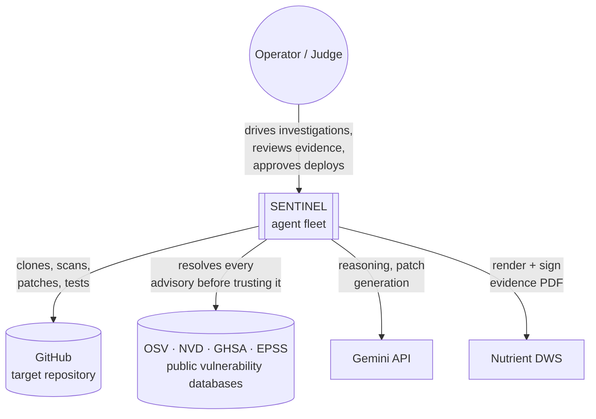
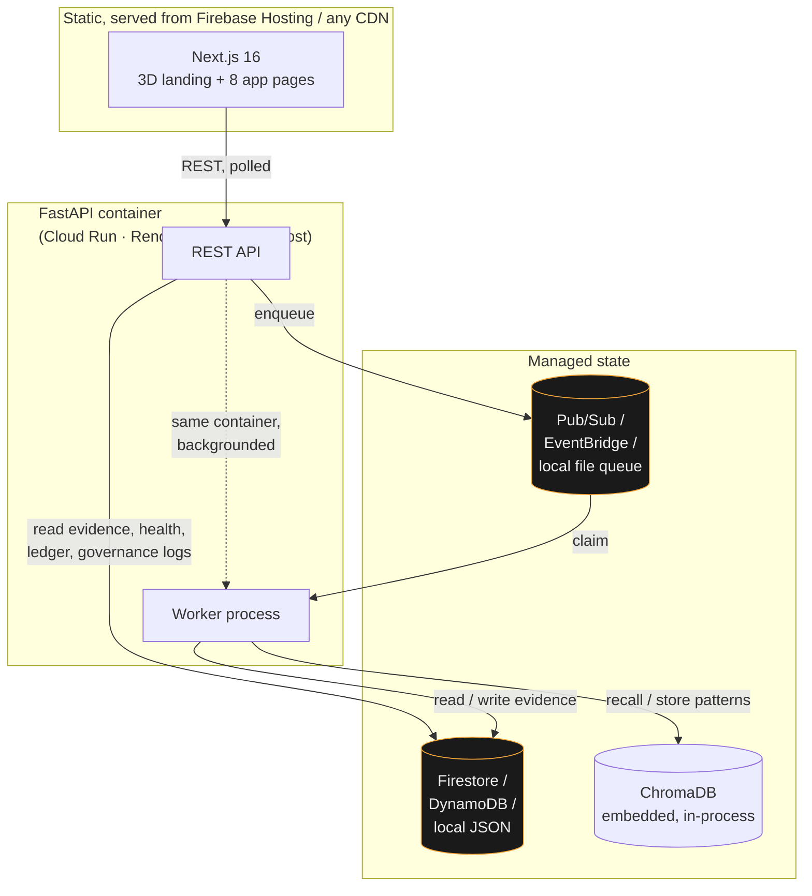
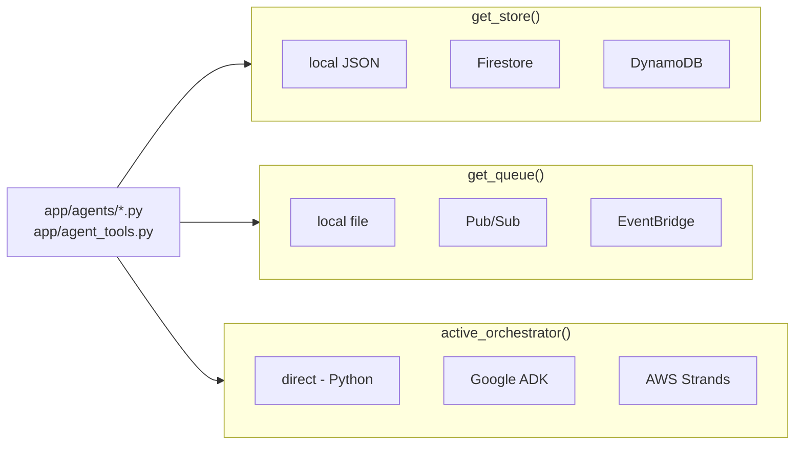

# SENTINEL — Architecture

This document exists for one audience: someone evaluating engineering
decisions, not features. [README.md](README.md) covers what SENTINEL does and
how to run it; this covers *why it is built the way it is*, organized around
the four things that actually separate a production-minded system from a
brittle script — decoupling, state management, credential security, and
failure handling — with the real incidents that shaped each one.

Every diagram here was rendered and verified before being committed. Every
incident in [§5](#5-failure-handling-what-actually-broke) links to the real
commit that fixed it — open any of them and the fix, the reasoning, and the
verification are all there in the commit body, not asserted here.

---

## Table of contents

1. [Design principles](#1-design-principles)
2. [System context](#2-system-context)
3. [Containers](#3-containers)
4. [Decoupling](#4-decoupling)
5. [Failure handling: what actually broke](#5-failure-handling-what-actually-broke)
6. [State and memory](#6-state-and-memory)
7. [Credential and secret handling](#7-credential-and-secret-handling)
8. [Trade-offs and what was rejected](#8-trade-offs-and-what-was-rejected)
9. [What would change at 100x scale](#9-what-would-change-at-100x-scale)

---

## 1. Design principles

Four rules the codebase is actually held to, not aspirations:

**A verdict is earned, never asserted.** Analyst may propose that a finding
looks reachable; nothing downstream is allowed to treat that as confirmed
until Verification Lab has executed a real exploit attempt against a real
checkout and observed the result. This is enforced by data flow, not
convention — `EvidenceObject.verification_results` is populated from
Verification Lab's actual output, and Analyst's `RelevanceVerdict` cannot
write to it.

**Orchestration is a pluggable strategy, not a fork.** `direct`, `adk`, and
`strands` (§4) are three ways of *deciding what order to call the same six
functions in*. None of them contains investigation logic of its own — that
would mean three copies of the thing that actually matters, verified three
times, drifting apart the first time one of them was patched and the others
weren't.

**Governance is enforced code, checked at every call, not a diagram.** The
Agent Gateway (`app/governance/gateway.py`) sits between every tool
invocation and its execution. An agent whose registry status is not
`approved` is refused regardless of what its identity scope would otherwise
permit — registry is checked before identity, deliberately, so an unapproved
agent cannot act on a technicality.

**A failure must be a loud, specific failure — never a quiet, wrong
success.** This is the rule most of §5 exists to defend. A degraded scan
reports itself as degraded rather than as "zero findings." A seal that
failed to issue is absent, never fabricated. An orchestrator that finishes
without sealing a record raises `OrchestratorDidNotSeal` rather than
returning nothing.

---

## 2. System context

*The system has exactly one human touchpoint by design — the Deployment
Gate — and exactly one repository under active investigation at a time.
Every other arrow is autonomous.*

---

## 3. Containers

*The two boxes marked in amber are the ones with three interchangeable
implementations apiece (§4) — everything else in the diagram has exactly
one. `UI` never talks to `Data` directly; every read goes back through the
API, which is what keeps the store and queue swappable without touching the
frontend at all.*

**Why the worker lives inside the API container.** This wasn't the original
design — see [§5, incident 3](#5-failure-handling-what-actually-broke). Two
separate processes is the right shape when you can run two containers; a
single-container host (Render's free tier, a minimal Cloud Run setup) gives
you one process to start, and a deploy that provisions a queue nobody
consumes from is a deploy that silently drops every investigation. `docker/start.sh`
backgrounds the worker and execs the API as PID 1, so both processes exist
under whichever hosting model is available, without the API and worker
knowing anything changed.

---

## 4. Decoupling

Two axes are fully pluggable, each behind one factory function, selected by
one environment variable, with zero call-site awareness of which
implementation is active:

**Store and queue** (`app/store/`, `app/queue/`) exist because the hackathon
constraint set is real, not just because decoupling is good practice: Google
names Firestore and Pub/Sub, AWS names DynamoDB and EventBridge, and a local
JSON file/queue means the whole system runs with zero cloud credentials for
anyone evaluating it cold. `get_store()` and `get_queue()` are the only two
functions in the codebase that read `SENTINEL_STORE_BACKEND` /
`SENTINEL_QUEUE_BACKEND` — every caller just holds an `EvidenceStore` or
`JobQueue` interface.

**Orchestration** (`app/orchestrator.py`) exists because Google requires ADK
and AWS requires Strands, and building the investigation logic twice to
satisfy both would mean two copies of the thing that has to be *correct*,
verified independently, and guaranteed never to drift. Instead, all three
orchestrators call the identical six functions in `app/agent_tools.py`. The
difference is genuinely only *who decides the call order* — `direct`
hardcodes it, `adk`/`strands` let their SDK's model plan it — which is also
why the result contract has to be identical across all three (see incident 5
below: it wasn't, at first).

---

## 5. Failure handling: what actually broke

Every row here is a real incident from this project's own development, not a
hypothetical resilience story. Each commit hash is real and pushed —
`git show <hash>` shows the actual diff, reasoning, and how it was verified.

| # | Symptom | Root cause | Fix |
|---|---|---|---|
| 1 | A from-scratch container hung silently on its first scan | `npm audit` hard-refuses without a lockfile, and the target repo's own `.gitignore` excludes `package-lock.json` — true of *any* repo that makes that choice, not a one-off | Self-heal: regenerate the lockfile with `--ignore-scripts` before auditing ([`b2fd6fa`](https://github.com/rakeshselvaraj0108/SENTINEL/commit/b2fd6fa29a1af8480539d90e5d6f9864c8c25858)) |
| 2 | The same fix then timed out on a slower host | The regeneration timeout (120s) was measured on a fast local machine; a shared free-tier CPU took longer | Bumped to 300s — a one-time cost per fresh clone, so the headroom doesn't affect the common case ([`b511f54`](https://github.com/rakeshselvaraj0108/SENTINEL/commit/b511f54e)) |
| 3 | A Cloud Run deploy would accept investigations that never ran | `deploy.sh` provisions the Pub/Sub subscription a worker consumes from, but nothing was ever deployed to *run* that worker | Bundled the worker into the API container's own startup ([`b2fd6fa`](https://github.com/rakeshselvaraj0108/SENTINEL/commit/b2fd6fa29a1af8480539d90e5d6f9864c8c25858)) |
| 4 | `/api/state` took 7.4s; the Command Center polls it every 2s | `get_queue()`/`get_store()` built a fresh cloud client — a new gRPC channel plus, for Pub/Sub, a topology check — on every single call | Cache one client per backend per process ([`da01371`](https://github.com/rakeshselvaraj0108/SENTINEL/commit/da01371)) — measured 7.41s → 0.75s |
| 5 | Selecting the Google ADK orchestrator produced a result the frontend silently couldn't render | `adk`/`strands` returned only a model transcript; the UI's `asInvestigationResult()` requires `verdict`/`patch`/`reverify`/`evidence` | All three orchestrators normalized onto one contract, sourced from the sealed record rather than the model's narration of it ([`8fdea5a`](https://github.com/rakeshselvaraj0108/SENTINEL/commit/8fdea5a)) |
| 6 | An LLM-driven orchestrator could finish narrating a full investigation without ever calling the tool that seals evidence | Nothing distinguished "the model said it was done" from "a record was actually sealed" | `OrchestratorDidNotSeal` — finishing without a fresh signature is a raised error, not an empty success ([`4fa594b`](https://github.com/rakeshselvaraj0108/SENTINEL/commit/4fa594b)) |
| 7 | Two jobs sat "running" for over a day and could never be re-investigated | A worker was killed mid-run; its claim on the job was never released, and the dedup check kept handing the dead job back forever | A generous lease (45 min — real investigations run 10-15) after which a silent job is reclaimed and failed explicitly ([`6fe6a29`](https://github.com/rakeshselvaraj0108/SENTINEL/commit/6fe6a29)) |
| 8 | The process came up looking healthy while silently running as a completely different system | `python-dotenv` searches upward from the current directory; started from the repo root instead of `backend/`, it found nothing — no API key, no GCP project, store and queue quietly falling back to local | `.env` loaded by absolute path; a relative `GOOGLE_APPLICATION_CREDENTIALS` resolved against `backend/` regardless of `cwd` ([`b723143`](https://github.com/rakeshselvaraj0108/SENTINEL/commit/b723143)) |
| 9 | A PII detection rendered identically to content where nothing was found | Only two severities existed (`clean`/`blocked`); PII was logged as `clean` because it doesn't block — but "doesn't block" and "found nothing" were being shown as the same thing | A third severity, `flagged`, distinct in the UI — 21 previously-invisible detections became visible on the first deploy after the fix ([`c031d85`](https://github.com/rakeshselvaraj0108/SENTINEL/commit/c031d85)) |
| 10 | Every page of the live public site logged 8 console errors, on every load | `next/link` prefetch and `router.prefetch()` both request an RSC payload that only exists behind a live Next.js server; a static export has none | `prefetch={false}` on all 10 `Link`s; the one imperative `router.prefetch()` call removed outright | ([`bc85c5b`](https://github.com/rakeshselvaraj0108/SENTINEL/commit/bc85c5b)) |

**The pattern underneath most of these:** the bug was in the path that only
executes when something else has already gone wrong — a cold cache, a slow
host, a killed process, a model that didn't call the tool it was supposed
to. Untested unhappy paths are where a system that looks solid in a demo
breaks in front of a judge running it themselves, which is exactly the
scenario every one of these was found by simulating.

---

## 6. State and memory

Five distinct pieces of state, each with a different lifetime and a
different consistency requirement — treating them as one undifferentiated
"database" is itself a design smell this system avoids:

| State | Where | Lifetime | Why it isn't just a database row |
|---|---|---|---|
| **Evidence records** | `EvidenceStore` (Firestore/DynamoDB/local) | Permanent | The unit the whole product is accountable for; every write is signed at write time, and `verify_signature()` recomputes independently at read time |
| **Job state** | `JobQueue` (Pub/Sub/EventBridge/local) | Transient — until `done`/`failed` | Deliberately *not* durable evidence; a job record says what was attempted, the evidence record says what was proven |
| **Findings cache** | In-process dict, per API instance | Until next scan or restart | A real `npm audit` costs ~15-60s; re-running it per request would make every page load pay that cost. Warmed on a background thread at startup so the API answers immediately rather than blocking on it |
| **Advisory cache** | Disk-backed JSON (`app/knowledge/advisory_cache.py`) | 7 days, successful lookups only | Advisory records are near-immutable, so re-resolving them every scan is pure latency. **Only successes are cached** — caching a failure would let a transient OSV outage masquerade as "permanently unresolved," defeating the degraded-scan detection this cache sits next to |
| **Memory bank** | ChromaDB, embedded in-process | Permanent, grows with usage | Recalls prior verdicts and verified fixes across investigations — the one piece of state that makes the system's judgment improve with use rather than starting cold every time |

**The ledger is verification, not storage.** `app/ledger.py` computes a
SHA-256 hash chain over agent actions and is deliberately stdlib-only, with
zero dependency on the store backend — a design constraint that exists so
the *frontend* can recompute the identical chain in TypeScript and cross-check
it, rather than trusting the backend's own claim that the chain is intact.
`src/lib/sentinel/ledger-contract.test.ts` pins the exact cross-language
digest; changing either implementation's hash format breaks the other's
tests, on purpose.

---

## 7. Credential and secret handling

- **Nothing is hardcoded.** Every credential is read from the environment;
  `.env` and `gcp-key.json` are gitignored, and CI has a dedicated job that
  fails the build if a `.env` is tracked or a key-shaped string is found
  anywhere in the tree.
- **Config loads by absolute path, not by search.** See incident 8 above —
  the fix that made this section worth writing.
- **A relative service-account path is resolved once, centrally.**
  `_absolutise_credentials()` in `app/config.py` rewrites a relative
  `GOOGLE_APPLICATION_CREDENTIALS` against `backend/`, so the Google client
  libraries — which resolve relative paths against whatever the process's
  `cwd` happens to be — get a working path regardless of how the process was
  started.
- **A JSON-blob escape hatch for hosts with no file-secret mechanism.**
  Some hosts (Hugging Face Spaces, some free tiers) only support
  environment-variable secrets, not file uploads. `docker/start.sh`
  materializes `GOOGLE_APPLICATION_CREDENTIALS_JSON` to a file at container
  start if one doesn't already exist at the target path — deliberately
  narrow: it only acts when the file is genuinely absent, so a host that
  *does* mount a real secret file (Render's secret files, for instance) is
  left untouched.
- **The actor in an audit record comes from the auth layer, never from the
  request.** An earlier version of the Deployment Gate accepted a
  client-supplied `actor` field — meaning anyone could forge who approved a
  production deploy in the record meant to prove that decision. `actor` is
  now taken exclusively from `auth.require_principal`, and
  `test_client_cannot_forge_the_actor` pins it.
- **Authentication is opt-in, not silently absent.** Without
  `SENTINEL_API_TOKENS`, the system runs — deliberately, for local
  evaluation with zero setup — but every mutating record is stamped
  `local-dev (unauthenticated)` rather than a plausible-looking fake
  identity, so an unauthenticated deployment is never mistaken for an
  authenticated one by looking at its own audit trail.

---

## 8. Trade-offs and what was rejected

**Polling over WebSockets/SSE for frontend state.** The Command Center
appears "real-time" but is actually `usePolledResource` on a self-scheduling
timeout (not `setInterval` — see below). A push-based transport would be
lower-latency, but it means an operable server component (connection state,
reconnect logic, a scaling story for concurrent connections) for a dashboard
where 2-8 second staleness is genuinely invisible to a human reading it. Not
worth the operational surface for this system's actual latency requirement.

**`setInterval` was rejected, not just avoided.** The polling hooks
originally used it, and it stacks: a poll that outlives its own interval (a
cold `/api/findings` scan legitimately can) causes the next tick to fire
while the first request is still in flight, and each overlap makes the next
one slower. Every poll loop in this codebase is a self-scheduling
`setTimeout` chain instead — at most one request in flight, with
backoff on consecutive failures.

**A single findings cache and dedup lock, not a distributed one.** Correct
for one API instance; wrong the moment there are two. Documented as a
[known limitation](README.md#15-limitations) rather than solved
speculatively — Redis-backed locking for a system that has never run more
than one instance would be complexity paying rent for a scaling problem that
does not exist yet.

**No message-level exactly-once processing.** `JobQueue.claim_next()` can, in
principle, hand the same job to two workers in a narrow race. Accepted
because `evidence_agent_seal_record` is idempotent per finding (it
reassembles from the current on-disk state every time) — a duplicate claim
produces a duplicate seal attempt on the same data, not divergent evidence.
Solving the race directly (leases with fencing tokens) would be real
engineering effort spent on a failure mode the actual write pattern already
tolerates.

**A worker thread, not a worker fleet.** `docker/start.sh` runs one worker
alongside the API in the same container — the right shape for a single-team
hackathon deployment, and a genuine simplification (§9 covers what changes
if that stops being true).

---

## 9. What would change at 100x scale

Named directly rather than implied, because a design that has never
confronted its own limits is harder to trust than one that states them:

- **Findings cache and dedup lock** move from in-process to Redis or
  Firestore-backed locking — the first thing that breaks with a second API
  instance.
- **Worker separates from the API container** into its own deployment
  (Cloud Run Jobs, a dedicated service) once investigation volume justifies
  scaling it independently of API traffic — undoing the incident-3 fix
  above, deliberately, once there's a platform to run two containers on.
- **Advisory cache** moves from a local JSON file to a shared cache (Redis,
  Firestore) so a fleet of API instances shares one warm cache instead of
  each paying the cold-lookup cost once.
- **The reachability analysis** (currently import/call-site tracing) is the
  ceiling on finding quality at any scale — more infrastructure doesn't fix
  a false negative from dynamic dispatch; that needs real dataflow analysis,
  independent of how many instances are running it.
- **Multi-tenant isolation.** Right now there is one target repository and
  implicitly one tenant. Real multi-tenancy needs the sandbox
  (`git worktree` today) hardened to container-per-run isolation, which is
  already flagged in [README §15](README.md#15-limitations) as a known gap
  rather than a solved problem.
