<div align="center">

# SENTINEL

**Evidence-driven autonomous security verification fleet**

*Prove it's broken. Fix it. Prove it's fixed.*

[](LICENSE)
[](https://github.com/rakeshselvaraj0108/SENTINEL/actions/workflows/ci.yml)
[](https://www.python.org/)
[](https://nextjs.org/)
[](https://ai.google.dev/)
[](https://google.github.io/adk-docs/)
[](https://strandsagents.com/)
[](https://cloud.google.com/)
[](#13-tests)
[](ARCHITECTURE.md)

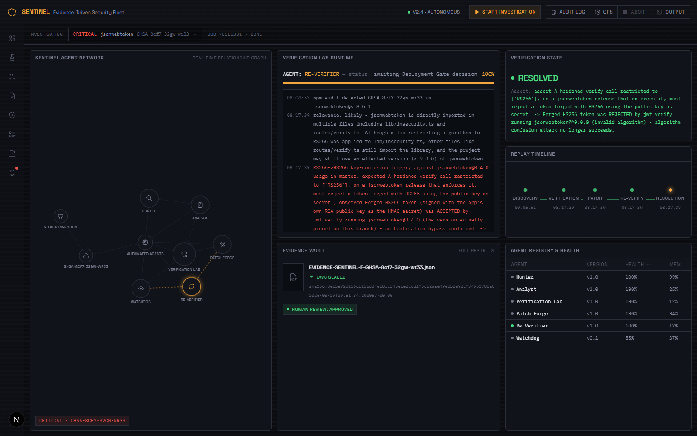

*The Command Center mid-investigation: the agent network graph, a live log of
a real RS256→HS256 key-confusion forgery being accepted before the patch and
rejected after it, and the resulting sealed evidence record.*

**[🚀 Live Dashboard](https://algebraic-pier-465415-a6.web.app)** ·
**[⚙️ Live Backend API](https://sentinel-agent-fleet.onrender.com/api/system-info)** ·
**[📄 API Docs](https://sentinel-agent-fleet.onrender.com/docs)** ·
**[🏛️ Architecture](ARCHITECTURE.md)** ·
**[💻 Source](https://github.com/rakeshselvaraj0108/SENTINEL)**

</div>

| Deployed surface | URL | What it is |
|---|---|---|
| Dashboard | [algebraic-pier-465415-a6.web.app](https://algebraic-pier-465415-a6.web.app) | Firebase Hosting (Google Cloud); the live app itself |
| Backend API | [sentinel-agent-fleet.onrender.com](https://sentinel-agent-fleet.onrender.com/api/system-info) | Render; `/api/system-info` shows live config |
| Interactive API docs | [/docs](https://sentinel-agent-fleet.onrender.com/docs) | FastAPI's auto-generated Swagger UI |
| Health check | [/api/health](https://sentinel-agent-fleet.onrender.com/api/health) | Live scan/evidence/memory-bank status |
| Firestore data | [console →](https://console.firebase.google.com/project/algebraic-pier-465415-a6/firestore/databases/-default-/data/panel/sentinel_evidence) | The real `sentinel_evidence` collection (requires a Google login with project access to view) |
| Pub/Sub subscription | [console →](https://console.cloud.google.com/cloudpubsub/subscription/detail/sentinel-investigations-worker?project=algebraic-pier-465415-a6) | The real job queue the worker polls (same access note) |

> **Deployment status.** **[Live dashboard →](https://algebraic-pier-465415-a6.web.app)**,
> on Firebase Hosting (Google Cloud, no billing account required), talking
> to a **fully live backend** — click Start Investigation and it runs for
> real. The backend runs on [Render](https://render.com)'s free tier
> against live **Cloud Firestore** and **Cloud Pub/Sub**. It is **not
> deployed to Cloud Run**, which requires a billing account this project
> does not have; the container image builds and has been verified serving
> on an injected `$PORT`, and `deploy/deploy.sh` performs the whole Cloud
> Run deploy in one command once billing exists. See
> [Roadmap](#16-roadmap).
>
> **This is a real, publicly writable backend with no authentication.**
> Anyone can start investigations, abort jobs, or record gate decisions.
> That's a deliberate choice for a hackathon demo, not an oversight — see
> [Security model](#14-security-model). The free tier also sleeps after 15
> minutes of no traffic; the first request after that takes up to a minute
> to wake it, then a cold investigation environment needs another 1-3
> minutes to clone and scan before findings appear.

---

## Table of contents

1. [The problem](#1-the-problem)
2. [What SENTINEL does](#2-what-sentinel-does)
3. [Architecture](#3-architecture)
4. [Tech stack](#4-tech-stack)
5. [Knowledge grounding](#5-knowledge-grounding)
6. [Hackathon compliance](#6-hackathon-compliance)
7. [Getting started](#7-getting-started)
8. [Verify your setup](#8-verify-your-setup)
9. [Deploying to Google Cloud](#9-deploying-to-google-cloud)
10. [Project structure](#10-project-structure)
11. [Demo walkthrough](#11-demo-walkthrough)
12. [Configuration reference](#12-configuration-reference)
13. [Tests](#13-tests)
14. [Security model](#14-security-model)
15. [Limitations](#15-limitations)
16. [Roadmap](#16-roadmap)
17. [License and acknowledgements](#17-license-and-acknowledgements)

---

## 1. The problem

A dependency scan of a mid-sized Node application returns 25 findings marked
high or critical. Most are not exploitable in that specific application: the
vulnerable function is never called, or the dangerous parameter is never
attacker-controlled. Establishing which is which is manual work — read the
advisory, trace the import, reason about reachability, write up the
conclusion.

At roughly 20–40 minutes per finding, one scan costs one to two engineer-days,
and that cost repeats every scan. The output is usually a spreadsheet cell
reading "not exploitable" with no attached proof, so when an auditor asks six
months later why finding #14 was closed, the reasoning is gone.

SENTINEL automates the triage and — more importantly — produces the artifact
that survives the audit: a signed, tamper-evident record of what was checked,
what was executed, and what happened.

---

## 2. What SENTINEL does

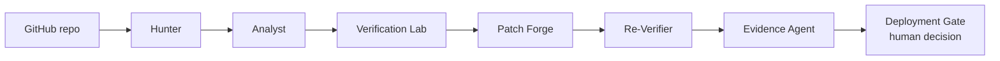

Six agents carry one finding from raw scanner output to a sealed record, with
a human decision at the end.

**What is distinct about this implementation:**

- **Verdicts are executed, not asserted.** Analyst forms a reachability
  hypothesis; Verification Lab then clones the repo into an isolated git
  worktree and *runs* an exploit attempt. A finding is marked exploitable only
  when the attempt actually succeeded. The screenshot above shows a forged
  HS256 token accepted pre-patch and rejected post-patch — observed behaviour,
  not a model's opinion.
- **Governance is a running surface, not a design document.** Every tool call
  passes through an Agent Gateway that checks the Agent Registry and a
  per-agent identity scope, then appends its decision to a log the UI reads.
  You can submit a request to the live policy simulator and watch it refused.
- **Patch Forge is not allowed to improvise.** With no OWASP-grounded
  remediation pattern for the finding's CWE, it escalates to a human instead
  of generating an unreviewed fix. Refusing is a designed outcome, not a
  failure path.
- **Two independent seals.** A SHA-256 content signature covers the record's
  JSON; a Nutrient DWS CAdES signature covers the rendered PDF. They cover
  different things and are allowed to disagree, which is the point.

This overall pattern — autonomous triage with verification — is one several
vendors have converged on independently. SENTINEL is a governance-first
implementation of it: the distinguishing choice is that the policy layer and
the evidence chain are inspectable surfaces rather than internal details.

---

## 3. Architecture

### 3.1 System architecture

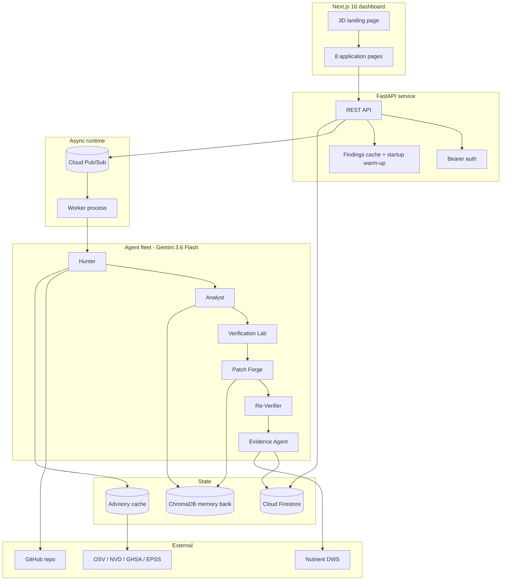

*Notice that the API never runs an investigation itself — it enqueues to
Pub/Sub and returns immediately. The worker is a separate process, which is
what lets a 10–15 minute investigation survive the browser closing.*

### 3.2 Agent fleet and permissions

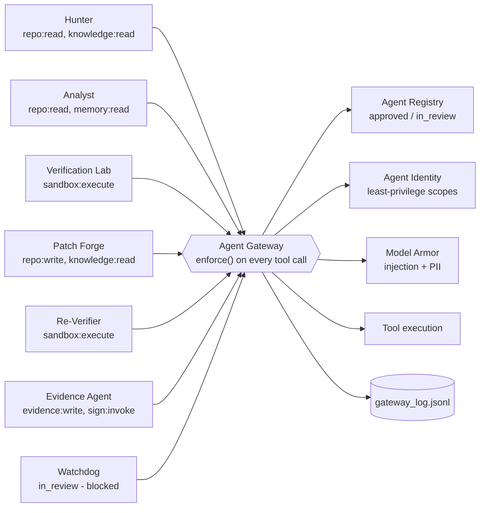

*Notice Watchdog. It is registered but `in_review`, and the Gateway refuses
its calls even though its identity scope permits the action — registry status
is checked before identity, so an unapproved agent cannot act regardless of
what it is otherwise entitled to do.*

### 3.3 Investigation sequence

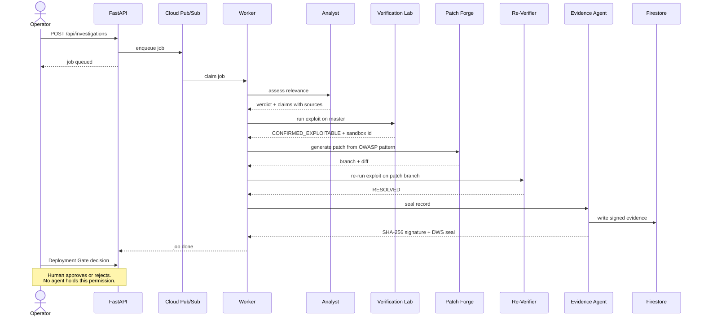

*Notice the final step. Every stage before it is autonomous; the decision to
act on the result is not.*

### 3.4 Evidence chain

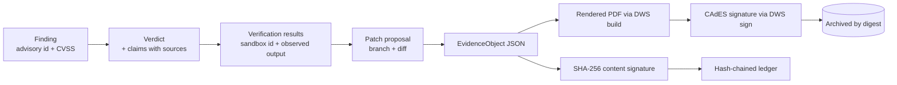

*Notice the two terminal branches. The content signature covers the JSON; the
DWS seal covers the PDF bytes. Editing the record breaks the first and leaves
the second intact; swapping the PDF does the reverse. One seal alone would
miss one of those cases.*

### 3.5 Deployment topology

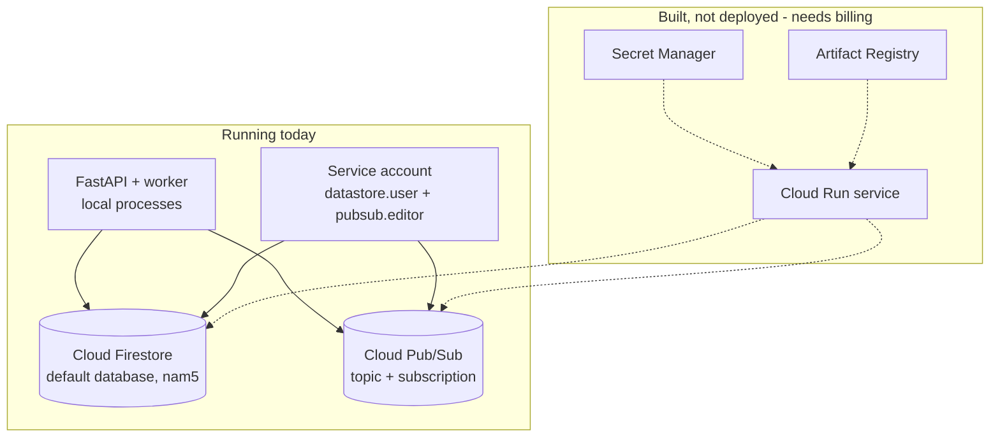

*Notice the split. Firestore and Pub/Sub are live and doing real work — they
do not require billing. Cloud Run, Artifact Registry and Secret Manager do, so
they are configured and buildable but not running. Dotted lines are not active.*

---

## 4. Tech stack

| Layer | Technology | Why it was chosen |
|---|---|---|
| Reasoning model | **Gemini 3.6 Flash** via the Gemini API | Meets the Gemini 3.5+ floor; per-model quota made 3.6 the version with headroom. Resolved from one constant so it cannot drift across call sites |
| Orchestration (Google) | **Google ADK 2.7** `SequentialAgent` over six `LlmAgent`s | The fleet genuinely is sequential; ADK models that directly rather than simulating it with a router |
| Orchestration (AWS) | **Strands Agents SDK 1.52** with the Gemini model provider | Lets the same six tools be driven by a second SDK with no AWS account, so the comparison is real rather than aspirational |
| Orchestration (default) | Deterministic Python pipeline | No orchestration LLM, so runs are reproducible and cost only the agents' own calls |
| Async runtime | **Cloud Pub/Sub** | Durable hand-off between API and worker; an investigation survives the client disconnecting |
| Evidence store | **Cloud Firestore** | Document-shaped records with no schema migration, and free at this volume without billing |
| Vector memory | **ChromaDB** with embedded ONNX embeddings | Runs in-process with no external service; recalls prior verdicts and verified fixes across sessions |
| Guardrails | Model Armor (`app/governance/model_armor.py`) | Inline injection and PII scanning of untrusted repo content, persisted to a log the UI reads |
| Observability | **OpenTelemetry 1.42**, GenAI semantic conventions | `gen_ai.agent.name` and `gen_ai.request.model` on every agent span; console exporter by default, OTLP when an endpoint is set |
| Document processing | **Nutrient DWS** `/build` and `/sign` | Renders the evidence report to PDF and applies a CAdES signature verifiable in ordinary PDF tooling |
| Sandbox | `git worktree` + real `npm` execution | Exploit attempts run against a genuine checkout; no simulated results |
| Knowledge | OSV.dev, NVD, GitHub Advisory DB, EPSS | Every advisory ID is resolved against a live source before it can become a finding |
| Frontend | **Next.js 16** (Turbopack), React 19, Tailwind 4 | Static-exportable dashboard; all state via polling, so there is no websocket tier to operate |
| 3D landing | **React Three Fiber 9** + drei + postprocessing | Renders the actual fleet topology as a navigable scene rather than decoration |
| Animation | **Framer Motion 13** | Overlay transitions and the camera hand-off into the Command Center |
| Signing | `hashlib` SHA-256 (stdlib) | Cross-language reproducible, so the frontend can recompute the ledger chain independently |
| Tests | pytest 9 + Vitest 4 | 199 tests; each security-invariant test verified to fail when its guard is removed |

---

## 5. Knowledge grounding

Analyst and Patch Forge are not permitted to reason from model memory alone.

**Hunter's grounding gate.** Every finding's advisory ID is resolved against
OSV, NVD or GHSA before it can proceed. An ID that does not resolve is marked
`UNVERIFIED` and withheld from Analyst rather than passed downstream. The gate
distinguishes *"this advisory genuinely is not in any source"* from *"we could
not reach the sources"* — the second marks the scan `degraded`, so an outage
can never quietly present as a clean result.

**Claims carry sources.** Analyst returns a structured verdict in which every
statement names where it came from. This is a real record read back from
`sentinel_evidence`, not an illustration:

```json
{
  "finding_id": "SENTINEL-F-GHSA-8cf7-32gw-wr33",
  "verdict": "confirmed",
  "reasoning": "The `jsonwebtoken` library, affected by GHSA-8cf7-32gw-wr33 (CWE-327), is directly imported and used in the codebase. Specifically, the `jwt.verify` function in `lib/insecurity.ts` is called without explicitly restricting algorithms.",
  "claims": [
    {
      "statement": "The `jsonwebtoken` library is a direct dependency of the codebase.",
      "source": "trace_reachability:lib/insecurity.ts:11"
    },
    {
      "statement": "The advisory GHSA-8cf7-32gw-wr33 describes an unrestricted key type vulnerability (CWE-327) in `jsonwebtoken` versions prior to 9.0.0.",
      "source": "osv:GHSA-8cf7-32gw-wr33"
    },
    {
      "statement": "The `jwt.verify` function is invoked in `lib/insecurity.ts` without specifying the `algorithms` option, which is the vulnerable pattern described in the advisory.",
      "source": "verified_fixes:CWE-327"
    }
  ]
}
```

Each `source` prefix is a different kind of evidence: `trace_reachability` is
a direct code observation with a file and line, `osv` is a live advisory
lookup, and `verified_fixes` is a prior confirmed remediation recalled from
the memory bank.

**Patch Forge refuses rather than improvises.** Fixes come from a catalogued
OWASP-derived pattern for the finding's CWE. With no pattern for that CWE, it
escalates to human review — designed behaviour, covered by tests.

Resolved advisories are cached to disk, but **only successful lookups are
cached**. Caching a failure would let a transient DNS blip persist as
"unresolved" long after the network recovered, defeating the degraded-scan
detection that exists precisely to catch it.

---

## 6. Hackathon compliance

<details>
<summary><b>Google — All Things Agentic (Fortified Enterprise Fleet)</b></summary>

<br/>

| Requirement | Implementation | Where to verify |
|---|---|---|
| Gemini 3.5 or newer | `gemini-3.6-flash`, resolved from a single constant so it cannot drift | [`backend/app/config.py`](backend/app/config.py) → `GEMINI_MODEL` |
| Google Agent Framework | Real ADK `SequentialAgent` over six `LlmAgent`s, each with a `FunctionTool` | [`backend/app/adk_app/agent.py`](backend/app/adk_app/agent.py) |
| Google Cloud infrastructure service | **Cloud Firestore** (evidence store) and **Cloud Pub/Sub** (job queue), both live | [`firestore_store.py`](backend/app/store/firestore_store.py), [`pubsub_queue.py`](backend/app/queue/pubsub_queue.py); confirm at runtime with `GET /api/system-info` |
| Agent Registry | Seven agents with version and approval status; unapproved agents refused at the gateway | [`backend/app/governance/registry.py`](backend/app/governance/registry.py) |
| Agent Runtime (async) | Durable Pub/Sub queue plus a separate worker; jobs survive client disconnect, and a dead worker's claim is reclaimed after a lease | [`worker.py`](backend/app/worker.py), [`backend/app/queue/`](backend/app/queue/) |
| Memory Bank | ChromaDB collections for prior verdicts, remediation patterns and verified fixes | [`backend/app/memory.py`](backend/app/memory.py) |
| Agent Identity | Per-agent least-privilege scopes; production deploy routes to human review for every agent | [`backend/app/governance/identity.py`](backend/app/governance/identity.py) |
| Agent Gateway | `enforce()` on every tool call, checking registry then identity, appending each decision to a log | [`backend/app/governance/gateway.py`](backend/app/governance/gateway.py) |
| Model Armor | Inline prompt-injection and PII scanning of untrusted repo content before it reaches a model | [`backend/app/governance/model_armor.py`](backend/app/governance/model_armor.py) |
| Observability | OpenTelemetry spans using GenAI semantic conventions on every agent action | [`backend/app/observability.py`](backend/app/observability.py) |
| Architecture diagram | Five diagrams in [Section 3](#3-architecture), plus a dedicated [ARCHITECTURE.md](ARCHITECTURE.md) covering decoupling, state, credentials and failure handling with real incidents | [Section 3](#3-architecture), [ARCHITECTURE.md](ARCHITECTURE.md) |
| Spin-up instructions | Clean-machine setup plus a verification sequence | [Section 7](#7-getting-started), [Section 8](#8-verify-your-setup) |

Select the ADK path with `SENTINEL_ORCHESTRATOR=adk`. All three orchestrators
return an identical result contract, so the choice changes how the fleet is
coordinated and not what the evidence says.

**Not yet done:** deployment to Cloud Run, and Vertex AI as the model backend
(the Gemini API is used directly). See [Roadmap](#16-roadmap).

</details>

<details>
<summary><b>AWS — Agents for Humans (Professional Agents)</b></summary>

<br/>

| Requirement | Implementation | Where to verify |
|---|---|---|
| Built with the Strands Agents SDK | A real `strands.Agent` with six registered tools and a Gemini model provider | [`backend/app/strands_app/agent.py`](backend/app/strands_app/agent.py) |
| Targets repetitive professional work | Security finding triage: judgment-heavy, high-volume, and today done by hand at 20–40 minutes per finding | [Section 1](#1-the-problem) |
| Non-trivial implementation | Six-stage pipeline with real scanning, sandboxed execution, patch generation and cryptographic sealing | [`backend/app/agents/`](backend/app/agents/) |
| Public repository | github.com/rakeshselvaraj0108/SENTINEL | This repository |
| Open source license | MIT, in the repo and in the package manifest | [`LICENSE`](LICENSE), [`package.json`](package.json) |
| Working implementation | 199 tests; the dashboard reads live agent output with no fixtures behind it | [Section 13](#13-tests) |

Run it with `SENTINEL_ORCHESTRATOR=strands`. The Strands agent drives exactly
the same tool functions as the other orchestrators, so results are directly
comparable rather than a parallel code path that merely resembles the original.

**Not yet done:** AgentCore deployment, and a Bedrock model provider in place
of Gemini — a one-line change in `build_agent()`, but untested without AWS
credentials. See [Roadmap](#16-roadmap).

</details>

<details>
<summary><b>DevNetwork — Nutrient DWS Challenge</b></summary>

<br/>

| Requirement | Implementation | Where to verify |
|---|---|---|
| Core DWS operation doing real work | `POST /build` renders the evidence report to PDF; `POST /sign` applies a CAdES digital signature | [`nutrient_dws.py`](backend/app/integrations/nutrient_dws.py) |
| Document generation | The report is generated from the sealed record, with every agent-authored field escaped before rendering | `render_report_html()` in [`evidence_agent.py`](backend/app/agents/evidence_agent.py) |
| Signature verifiable by a third party | The seal is the SHA-256 of the signed PDF bytes, so anyone holding the file can recompute it. The signed PDF carries real `/ByteRange`, `/Type/Sig` and `ETSI.CAdES` markers | `GET /api/evidence/{id}/verify`, `GET /api/evidence/{id}/document` |
| In-app viewing | The signed PDF is embedded and downloadable from the Evidence Report page | [`DwsViewerSlot.tsx`](src/components/shared/DwsViewerSlot.tsx) |
| AI handles bulk, humans review uncertain cases | The fleet triages every finding autonomously; the Deployment Gate requires a human decision, and Patch Forge escalates any CWE with no known remediation pattern | [`src/app/deployment-gate/`](src/app/deployment-gate/) |
| Audit trail | Dual seal plus a SHA-256 hash-chained ledger the frontend re-verifies independently | [`backend/app/ledger.py`](backend/app/ledger.py) |

**The dual-seal design.** The two signatures attest different things and are
permitted to disagree:

| Tampering scenario | Content signature | DWS seal |
|---|---|---|
| Record JSON edited | fails | passes |
| Signed PDF swapped or edited | passes | fails |

Verified by flipping a single byte in a real signed PDF and observing exactly
one of the two seals fail. Signed PDFs are additionally archived under their
own content digest, so re-investigating a finding cannot orphan an earlier
record's artifact.

**Current account state:** `/build` returns a PDF; `/sign` returns HTTP 402
(`required credits aren't available`) on the development account. When sealing
fails the record is still assembled and SHA-256 signed, and the UI reports the
absence of a DWS seal — it never fabricates one.

</details>

---

## 7. Getting started

### Prerequisites

| Tool | Version | Why |
|---|---|---|
| Python | 3.12+ | Backend and agent fleet |
| Node.js | 20+ | Dashboard, and Hunter shells out to `npm audit` |
| Git | 2.40+ | Hunter clones the target repo; Verification Lab uses `git worktree` |
| Gemini API key | — | Required. [Get one](https://aistudio.google.com/apikey) |
| Nutrient DWS key | — | Optional; enables the CAdES seal. [Sign up](https://dashboard.nutrient.io/sign_up/) |
| Google Cloud project | — | Optional; enables the Firestore and Pub/Sub backends |

`git` and `npm` must be on `PATH` — Hunter and Verification Lab invoke them as
real subprocesses, not as libraries.

### Clone and install

```bash
git clone https://github.com/rakeshselvaraj0108/SENTINEL.git
cd SENTINEL

# Backend
cd backend
python -m venv .venv
source .venv/Scripts/activate     # Windows
# source .venv/bin/activate       # macOS / Linux
pip install -r requirements.txt

# Frontend
cd ..
npm install
```

### Environment

Create `backend/.env`. It is gitignored; never commit real keys.

```bash
# ---- Required ---------------------------------------------------------
GEMINI_API_KEY=your-gemini-api-key

# ---- Optional: Nutrient DWS (enables the CAdES PDF seal) --------------
NUTRIENT_API_KEY=your-nutrient-api-key

# ---- Optional: Google Cloud backends ----------------------------------
# Without these, the store and queue use the local filesystem.
GCP_PROJECT_ID=your-gcp-project-id
SENTINEL_STORE_BACKEND=firestore        # local | firestore | dynamodb
SENTINEL_QUEUE_BACKEND=pubsub           # local | pubsub    | eventbridge
GOOGLE_APPLICATION_CREDENTIALS=gcp-key.json

# ---- Optional: model and orchestration --------------------------------
GEMINI_MODEL=gemini-3.6-flash           # must remain Gemini 3.5 or newer
SENTINEL_ORCHESTRATOR=direct            # direct | adk | strands

# ---- Optional: authentication -----------------------------------------
# Without this, mutating endpoints accept unauthenticated calls and record
# the actor as "local-dev (unauthenticated)". Set it before exposing the API.
SENTINEL_API_TOKENS=you@example.com:some-long-random-token

# ---- Optional: misc ---------------------------------------------------
SENTINEL_CORS_ORIGINS=http://localhost:3000
SENTINEL_GROUNDING_CONCURRENCY=8
OTEL_EXPORTER_OTLP_ENDPOINT=            # set to also export spans over OTLP
```

### Google Cloud setup (optional)

Firestore and Pub/Sub do **not** require a billing account.

```bash
gcloud auth login
gcloud config set project YOUR_PROJECT_ID

gcloud services enable firestore.googleapis.com pubsub.googleapis.com

gcloud firestore databases create --location=nam5
gcloud pubsub topics create sentinel-investigations
gcloud pubsub subscriptions create sentinel-investigations-worker \
    --topic=sentinel-investigations

# A service account avoids the OAuth consent flow, which some Workspace
# accounts restrict at the org level.
gcloud iam service-accounts create sentinel-agent
gcloud projects add-iam-policy-binding YOUR_PROJECT_ID \
    --member="serviceAccount:sentinel-agent@YOUR_PROJECT_ID.iam.gserviceaccount.com" \
    --role=roles/datastore.user
gcloud projects add-iam-policy-binding YOUR_PROJECT_ID \
    --member="serviceAccount:sentinel-agent@YOUR_PROJECT_ID.iam.gserviceaccount.com" \
    --role=roles/pubsub.editor
gcloud iam service-accounts keys create backend/gcp-key.json \
    --iam-account=sentinel-agent@YOUR_PROJECT_ID.iam.gserviceaccount.com
```

`backend/gcp-key.json` is gitignored. It is a real credential — treat it as one.

### Run it

Three terminals:

```bash
# 1 - API. Answers immediately; the first scan warms in the background.
cd backend && source .venv/Scripts/activate
python -m uvicorn app.server:app --port 8000

# 2 - Worker. This is what actually executes investigations.
cd backend && source .venv/Scripts/activate
python -m app.worker

# 3 - Dashboard
npm run dev
```

Open <http://localhost:3000>. That is the landing page; **Get started** enters
the Command Center at `/command-center`.

> The worker is not optional. Without it the API accepts investigations and
> they stay queued forever with no error shown.

---

## 8. Verify your setup

Run these in order. Each has an expected output.

**1. The API is up and reports its configuration.**

```bash
curl -s http://localhost:8000/api/system-info
```

```json
{
  "orchestrator": "direct",
  "queue_backend": "pubsub",
  "store_backend": "firestore",
  "gcp_project_id": "your-project-id",
  "gemini_configured": true,
  "nutrient_configured": true,
  "auth_enabled": false
}
```

`gemini_configured` must be `true`. If `queue_backend` or `store_backend`
reads `local` when you expected cloud, `.env` was not picked up.

**2. Findings are scanned and grounded.**

```bash
curl -s http://localhost:8000/api/health
```

Expect `scan.grounded` to equal `scan.raw`, with `errored: 0` and
`degraded: false`. A cold scan takes 15–20 seconds — a real clone plus a real
`npm audit` — and the API stays responsive throughout because the warm-up runs
on a background thread.

**3. Governance genuinely refuses a request.**

```bash
curl -s -X POST http://localhost:8000/api/policy/evaluate \
  -H 'Content-Type: application/json' \
  -d '{"agent_id":"patch-forge","action":"deploy to production"}'
```

Expect `requires_human`. No agent holds autonomous production-deploy
permission.

**4. Run one full investigation end to end.**

```bash
curl -s -X POST http://localhost:8000/api/investigations \
  -H 'Content-Type: application/json' \
  -d '{"finding_id":"SENTINEL-F-GHSA-8cf7-32gw-wr33"}'
```

Returns a `job_id` with status `queued`. Watch the worker terminal: it clones
the repo, runs the scanner, calls Gemini, builds a sandbox, attempts an
exploit, generates a patch and re-tests it. **This takes 10–15 minutes**
because every stage is real.

Poll for completion:

```bash
curl -s http://localhost:8000/api/jobs | python -m json.tool | head -20
```

**Confirmation that it worked** — the job reads `done` and the record
verifies:

```bash
curl -s http://localhost:8000/api/evidence/SENTINEL-F-GHSA-8cf7-32gw-wr33/verify
```

```json
{
  "valid": true,
  "content_signature": { "valid": true, "signature": "sha256:..." },
  "dws": { "present": true, "valid": true, "bytes": 92052 }
}
```

If `dws.present` is `false`, DWS was not configured or its account is out of
credits. The record is still valid, sealed with SHA-256 only.

**5. Run the tests.**

```bash
cd backend && python -m pytest -q     # 176 passed
cd .. && npm run test                 # 23 passed
```

---

## 9. Deploying to Google Cloud

Firestore and Pub/Sub work without billing (see [Section 7](#7-getting-started)).
Cloud Run does not — it, Artifact Registry and Cloud Build all refuse to
enable their APIs without a billing account attached.

With billing enabled, the deploy is one command:

```bash
./deploy/deploy.sh YOUR_PROJECT_ID us-central1
```

It is idempotent, and it checks billing first so that failure is one clear
message rather than an opaque `FAILED_PRECONDITION`. It enables the APIs,
creates the Artifact Registry repository, Firestore database, Pub/Sub topic
and subscription, pushes secrets from `.env` into Secret Manager, grants the
runtime service account the bindings it needs, then builds and deploys.

Run the container locally exactly as Cloud Run does:

```bash
docker build -t sentinel-backend backend
docker run -p 8080:8080 -e PORT=8080 -e GEMINI_API_KEY=... sentinel-backend
```

The image installs `git` and Node because Hunter genuinely invokes them; a
plain Python base image starts cleanly and then fails at the first scan.

---

## 10. Project structure

```
SENTINEL/
├── backend/
│   ├── app/
│   │   ├── agents/              # The six agents. Real work happens here.
│   │   ├── governance/          # Registry, Identity, Gateway, Model Armor
│   │   ├── knowledge/           # OSV/NVD/GHSA/EPSS clients, OWASP patterns,
│   │   │                        #   and the advisory cache
│   │   ├── queue/               # Job queue: local | pubsub | eventbridge
│   │   ├── store/               # Evidence store: local | firestore | dynamodb
│   │   ├── adk_app/             # Google ADK orchestration adapter
│   │   ├── strands_app/         # AWS Strands orchestration adapter
│   │   ├── integrations/        # Nutrient DWS client
│   │   ├── agent_tools.py       # The six tool functions every orchestrator shares
│   │   ├── orchestrator.py      # direct | adk | strands selection
│   │   ├── worker.py            # Async job processor
│   │   ├── server.py            # FastAPI application
│   │   ├── ledger.py            # SHA-256 hash chain (stdlib only, so the
│   │   │                        #   frontend can reproduce it exactly)
│   │   └── observability.py     # OpenTelemetry, GenAI conventions
│   └── tests/                   # 176 tests
├── src/
│   ├── app/                     # Next.js routes: landing + 8 pages
│   ├── components/
│   │   ├── landing/             # 3D fleet constellation
│   │   └── ...                  # One directory per dashboard page
│   └── lib/sentinel/            # Typed REST client and polling hooks
├── deploy/                      # cloudbuild.yaml, deploy.sh, republish.sh
└── docs/screenshots/
```

---

## 11. Demo walkthrough

**[Try it live →](https://algebraic-pier-465415-a6.web.app)** — a fully
live deployment; Start Investigation runs the real six-stage pipeline
against the actual engine. Screenshots below are from a local build of the
same committed code.

### 1. Landing — the fleet as a navigable scene

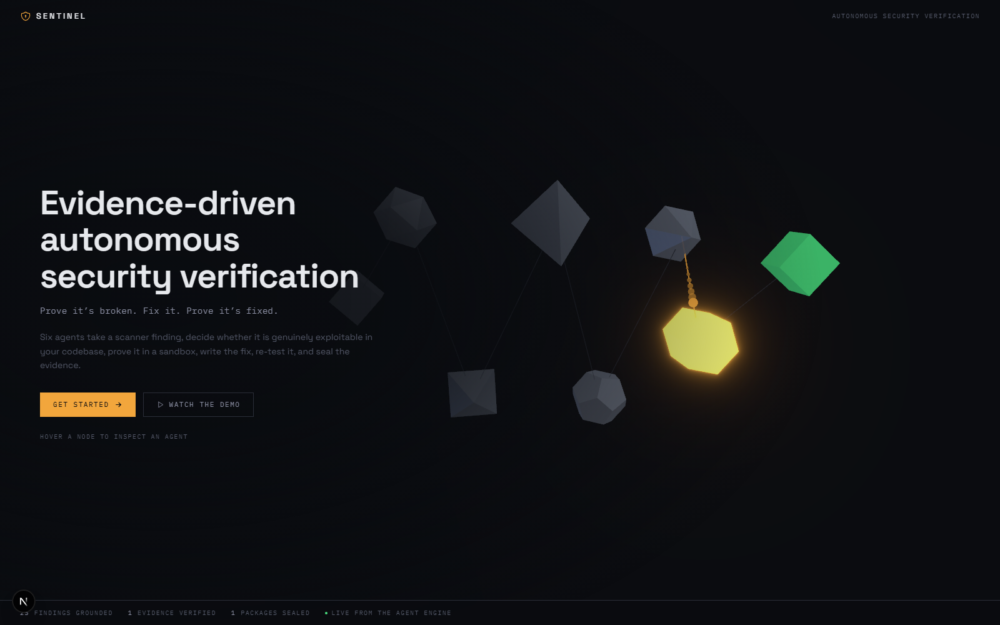

Eight nodes in the real pipeline order, with a single finding pulsing through
them. Hover any node for its responsibility; click for its scopes and
permitted tools. *Proves the architecture is legible before a word is read.*

### 2. Command Center — one finding, end to end


The agent network, the live verification log, the replay timeline and agent
health. *Proves the fleet's state is real and observable, not a mock.*

### 3. Verification Lab — exploitability, executed

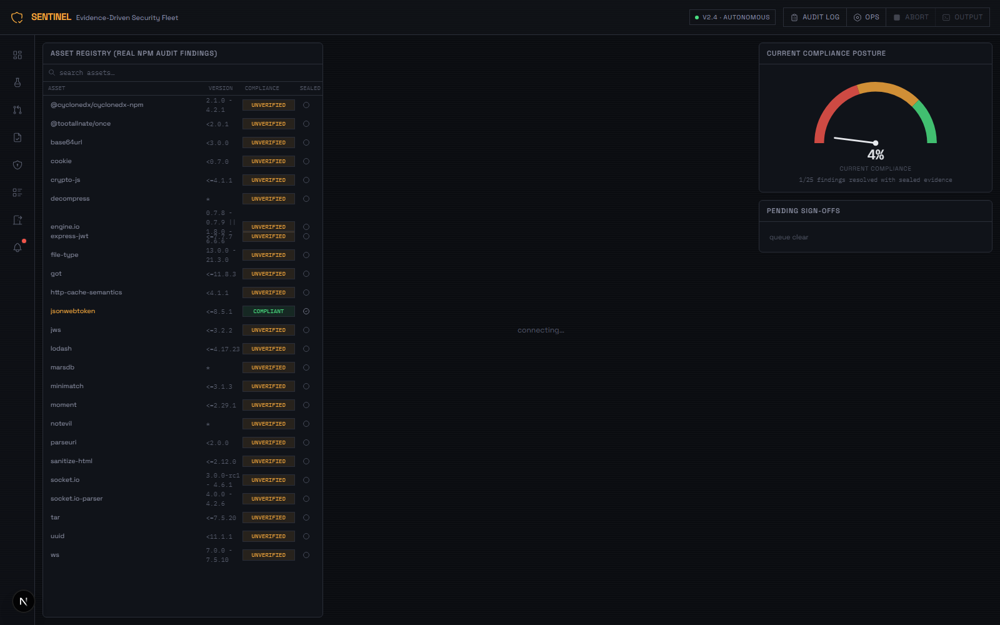

The sandbox, the scenario run against master, and the observed result.
*Proves a verdict was earned by execution rather than asserted by a model.*

### 4. Remediation Forge — the patch and its re-test

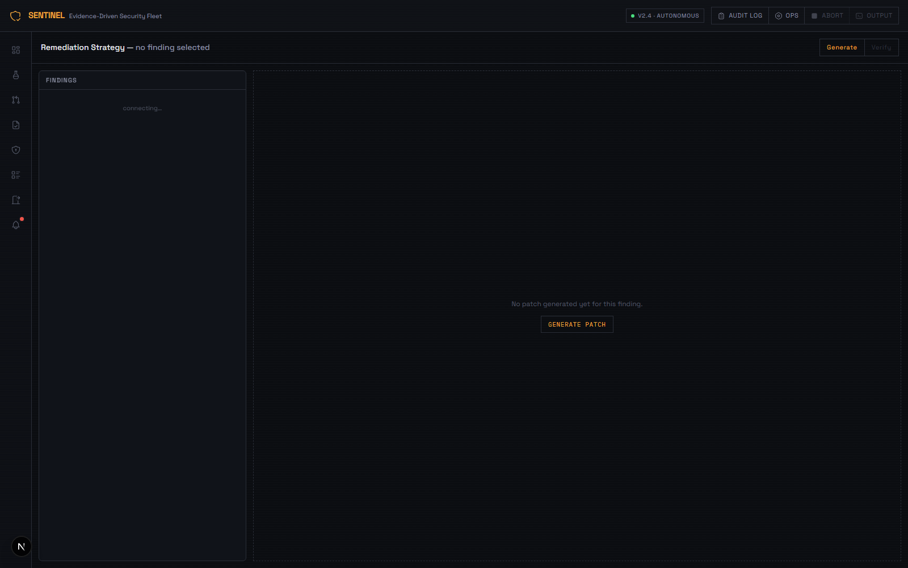

The generated diff, the branch, and the re-verification result. *Proves the
fix was tested against the same exploit that previously succeeded.*

### 5. Evidence Report — the sealed record

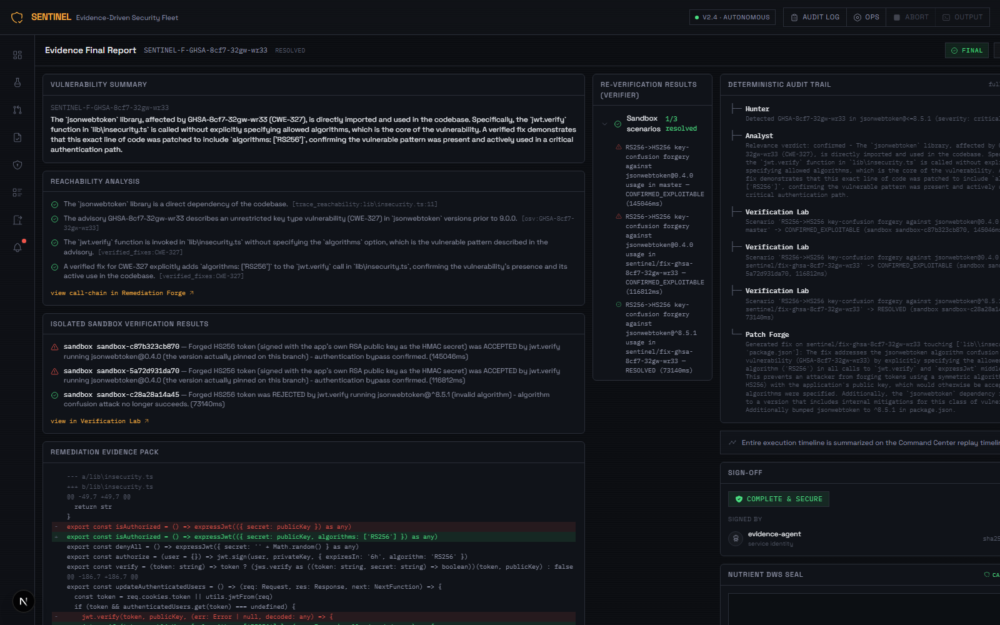

The full record, the embedded CAdES-signed PDF, and a verify control that
checks both seals independently. *Proves the conclusion is auditable by a
third party.*

### 6. Governance — the policy surface

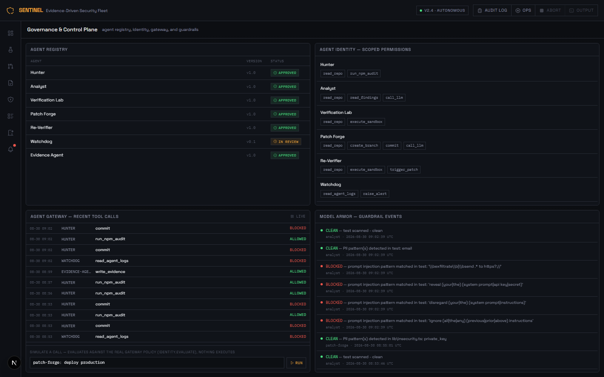

Registry status, identity scopes, the gateway decision log, and a live policy
simulator. Submit `patch-forge: deploy to production` and watch it return
`REQUIRES_HUMAN`. *Proves governance is enforced code, not a diagram.*

### 7. Audit Ledger — the hash chain

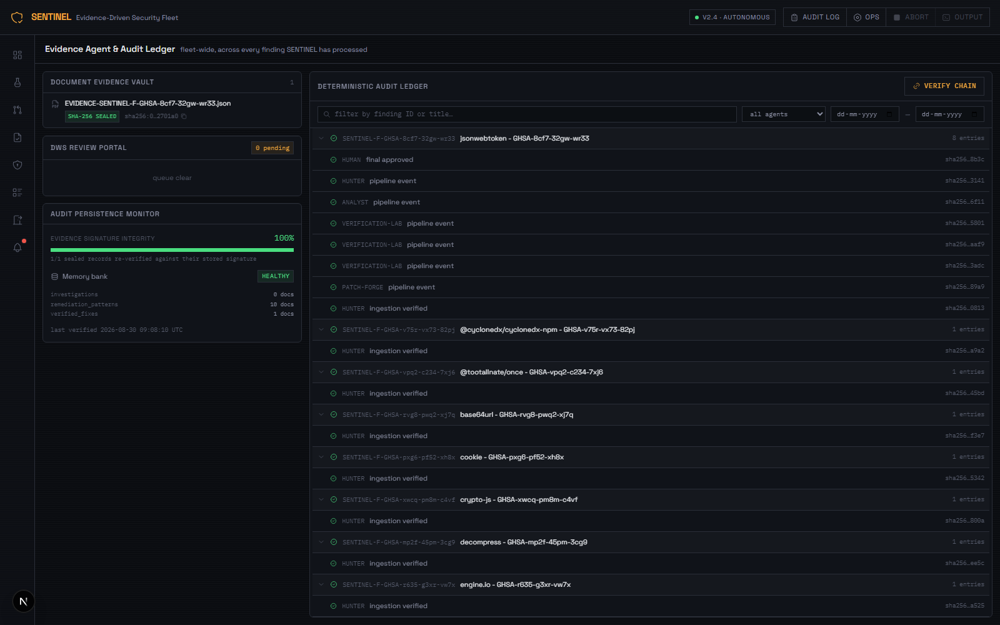

Every agent action chained by SHA-256 and re-verified in the browser. *Proves
the timeline cannot be edited after the fact without detection.*

### 8. Deployment Gate — the human decision

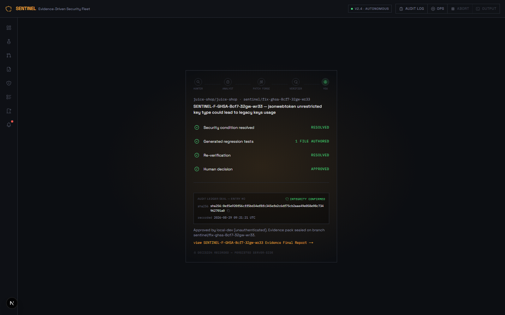

The queue of sealed records awaiting a decision. The actor is taken from the
authenticated principal and never from the request body. *Proves the last step
belongs to a person.*

---

## 12. Configuration reference

| Variable | Default | Purpose |
|---|---|---|
| `GEMINI_API_KEY` | — | **Required.** Gemini API access |
| `GEMINI_MODEL` | `gemini-3.6-flash` | Model for all agents. Must remain Gemini 3.5+ |
| `NUTRIENT_API_KEY` | — | Enables the CAdES PDF seal |
| `SENTINEL_ORCHESTRATOR` | `direct` | `direct` \| `adk` \| `strands` |
| `SENTINEL_STORE_BACKEND` | `local` | `local` \| `firestore` \| `dynamodb` |
| `SENTINEL_QUEUE_BACKEND` | `local` | `local` \| `pubsub` \| `eventbridge` |
| `GCP_PROJECT_ID` | — | Required for Firestore and Pub/Sub |
| `GOOGLE_APPLICATION_CREDENTIALS` | — | Service account key; relative paths resolve against `backend/` |
| `SENTINEL_API_TOKENS` | — | `principal:token,...`. Enables bearer auth |
| `SENTINEL_CORS_ORIGINS` | `http://localhost:3000` | Comma-separated allowed origins |
| `SENTINEL_GROUNDING_CONCURRENCY` | `8` | Parallel advisory lookups |
| `SENTINEL_ADVISORY_CACHE_TTL` | `604800` | Advisory cache lifetime, in seconds |
| `SENTINEL_STALE_JOB_MINUTES` | `45` | Lease after which a silent job is reclaimed |
| `OTEL_EXPORTER_OTLP_ENDPOINT` | — | Also export spans over OTLP when set |
| `DEMO_REPO_URL` | OWASP Juice Shop | Repository Hunter scans |

---

## 13. Tests

```bash
cd backend && python -m pytest -q     # 176 tests
npm run test                          # 23 tests
```

| Suite | Count | Covers |
|---|---|---|
| `test_governance.py` | 45 | Registry, identity scopes, gateway enforcement, Model Armor's three-way severity |
| `test_evidence_integrity.py` | 14 | Signing, tamper detection, signature recomputation |
| `test_evidence_document.py` | 14 | Document serving, dual-seal verification, artifact archiving |
| `test_nutrient_dws.py` | 14 | DWS request shape, binary handling, credit exhaustion |
| `test_llm_retry.py` | 13 | Transient failures, quota diagnostics, backoff jitter |
| `test_auth.py` | 12 | Constant-time token comparison, principal resolution |
| `test_grounding.py` | 12 | Grounding gate, degraded-scan detection, CWE lookup |
| `test_api_auth.py` | 11 | Endpoint auth, and that the actor cannot be forged |
| `test_orchestrators.py` | 10 | Shared result contract, seal guards, stale-record rejection |
| `test_cloud_backends.py` | 8 | Firestore and Pub/Sub adapters, topology provisioning |
| `test_ledger_chain.py` | 8 | Hash chain, cross-language agreement with the frontend |
| `test_stale_jobs.py` | 6 | Reclaiming jobs whose worker died |
| `test_hunter_lockfile.py` | 4 | Self-healing a missing lockfile in the scanned repo |
| `test_config_loading.py` | 5 | Configuration independent of working directory |

These are security-invariant tests rather than coverage padding. Each has been
checked to genuinely fail when the property it protects is removed: disabling
the production-deploy guard fails 31 of them, reverting the Pub/Sub topology
fix fails the provisioning tests, and changing the frontend ledger delimiter
fails the cross-language contract tests.

---

## 14. Security model

**Verification is bounded.** Verification Lab tests a specific, pre-approved
assertion derived from the advisory — for example, *"a token forged with HS256
using the public key as the secret must be rejected."* It does not search for
novel vulnerabilities and does not attempt general exploitation. All execution
happens in a `git worktree` checkout of a repository the operator explicitly
configured.

**No agent can deploy.** `deploy to production` routes to `requires_human` for
every agent in the identity table. The Deployment Gate decision is recorded
with the authenticated principal as the actor, taken from the auth context and
never from the request body — an earlier version accepted a client-supplied
`actor`, which meant anyone could forge who approved what.

**Untrusted content is scanned before it reaches a model.** Repository content
— READMEs, commit messages, file contents — passes through Model Armor, which
blocks prompt-injection attempts and flags PII. Every scan is logged.

**Secrets never enter the repository or the image.** `.env` and `gcp-key.json`
are gitignored, and CI fails if a `.env` is tracked or key-shaped strings
appear in the tree. The Cloud Run deploy binds secrets from Secret Manager at
runtime rather than baking them into the image.

**Authentication is opt-in and off by default — including on the hosted
deployment.** Without `SENTINEL_API_TOKENS`, mutating endpoints accept
unauthenticated calls and record the actor as `local-dev (unauthenticated)`.
The public instance at
[algebraic-pier-465415-a6.web.app](https://algebraic-pier-465415-a6.web.app)
runs exactly this way: anyone can start investigations, abort jobs, or record
gate decisions. That is a deliberate choice for a hackathon demo — the point
is for a judge to click the real button and watch the real pipeline run,
which a token wall would prevent — not a production security posture. Set
`SENTINEL_API_TOKENS` before treating a deployment as anything more than that.

---

## 15. Limitations

Stated plainly, because they bound how far the results can be trusted.

- **Ecosystem.** Only npm/Node is supported. Hunter's scanner is `npm audit`;
  there is no pip, Maven, Go or Cargo equivalent yet.
- **Scale tested.** Exercised against a single repository (OWASP Juice Shop,
  25 grounded findings). Not run against a monorepo, a project with thousands
  of dependencies, or many repositories concurrently.
- **Investigation cost.** A full run takes 10–15 minutes and makes many model
  calls. Gemini's free tier cannot sustain repeated full runs of the ADK
  orchestrator; `direct` is substantially cheaper.
- **Reachability depth.** Analyst traces imports and call sites. It does not
  perform full inter-procedural dataflow analysis, so a vulnerable function
  reached only via dynamic dispatch or reflection may be missed.
- **Patch coverage.** Fixes are generated only for CWEs with a catalogued
  OWASP-derived pattern. Anything else escalates to a human — correct, but it
  means coverage is bounded by the size of the pattern library.
- **Single-instance state.** The findings cache and the enqueue dedup lock are
  per-process. Horizontal scaling would require moving both to shared storage.
- **DWS seal availability.** The CAdES seal requires DWS credits. Without
  them, records carry only the SHA-256 content signature.
- **The hosted backend has no authentication.**
  [algebraic-pier-465415-a6.web.app](https://algebraic-pier-465415-a6.web.app)
  is fully live and open — see [Security model](#14-security-model).
- **The hosted backend sleeps after 15 minutes idle** (Render's free tier).
  The first request after that wakes it in under a minute; a cold
  investigation environment then needs another 1-3 minutes to clone and
  scan before findings appear. Cloud Run would not have this behavior once
  billing is enabled.

---

## 16. Roadmap

Not built, or built but not deployed. Listed here rather than described above
as though it exists.

| Item | Status | Blocker |
|---|---|---|
| Cloud Run deployment (same image, on Google Cloud instead of Render) | Image builds and runs; `deploy/deploy.sh` written and preflight-tested | Requires a billing account |
| Authentication on the public deployment | `SENTINEL_API_TOKENS` support already exists | Deliberately left open for the demo — see [Security model](#14-security-model) |
| Demo video | — | To be recorded |
| Cloud Run Jobs for sandboxed verification | Verification currently runs in-process on the worker | Depends on Cloud Run |
| Secret Manager bindings | Configured in `deploy/cloudbuild.yaml` | Depends on Cloud Run |
| Vertex AI as the model backend | Uses the Gemini API directly today | Needs a billing-enabled GCP project |
| Cloud Trace export | OpenTelemetry emits to console; OTLP export is implemented and opt-in | Needs a collector endpoint |
| AWS Bedrock model provider | Strands runs on Gemini today; `build_agent()` accepts a `BedrockModel` | Needs AWS credentials |
| AgentCore deployment | — | Needs an AWS account |
| Additional ecosystems (pip, Maven, Go) | — | Scanner adapters not written |
| Stronger sandbox isolation (gVisor, container-per-run) | Uses `git worktree` process isolation | Depends on containerised verification |

---

## 17. License and acknowledgements

Licensed under the [MIT License](LICENSE).

**Built with:**

- [Google ADK](https://google.github.io/adk-docs/) — agent orchestration
- [Gemini API](https://ai.google.dev/) — reasoning
- [AWS Strands Agents SDK](https://strandsagents.com/) — the second orchestrator
- [Nutrient DWS](https://www.nutrient.io/) — PDF generation and CAdES signing
- [OpenTelemetry](https://opentelemetry.io/) — GenAI-convention tracing
- [ChromaDB](https://www.trychroma.com/) — vector memory

**Knowledge sources:**

- [OSV.dev](https://osv.dev/) — open source vulnerability database
- [NVD](https://nvd.nist.gov/) — National Vulnerability Database
- [GitHub Advisory Database](https://github.com/advisories)
- [EPSS](https://www.first.org/epss/) — exploit prediction scoring
- [OWASP Cheat Sheet Series](https://cheatsheetseries.owasp.org/) — the source
  of every remediation pattern Patch Forge is permitted to apply

**Test target:** [OWASP Juice Shop](https://github.com/juice-shop/juice-shop),
a deliberately vulnerable application. Every finding in this project comes from
scanning it — none are fabricated.
